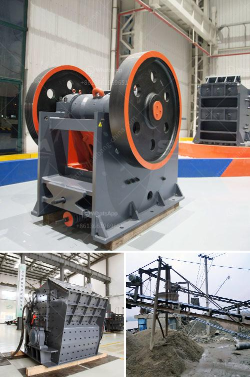

<h3>sand making plant china</h3>
With rapid urbanization and growing infrastructure projects, the demand for sand has skyrocketed in recent years. China, as the world's largest consumer and producer of sand, has not only recognized this need but has also taken the initiative to revolutionize the sand production process. Through the establishment of sand making plants, China has transformed the industry, ensuring consistent supply and superior quality sand for the construction sector.

The sand making plant is a facility consisting of equipment, machinery, and processes designed to produce artificial sand or manufactured sand. It is a crucial element in the construction industry as it provides the primary ingredient for concrete and mortar, which are fundamental building materials. Traditionally, natural river sand was used for these purposes. However, due to its limited availability and unsustainable extraction methods, alternative solutions were desperately needed.

China identified the potential of manufactured sand and introduced advanced technology to produce high-quality artificial sand. The sand making plant ensures the supply of a sustainable and environmentally friendly substitute for river sand. By crushing hard stones or rocks, the plant converts them into finely graded particles that mimic the characteristics of natural sand. These particles go through various screening and washing processes to remove impurities, resulting in consistent quality and strength suitable for construction applications.

One of the key advantages of China's sand making plant is its automation and efficiency. State-of-the-art equipment and intelligent control systems ensure smooth and uninterrupted operations, reducing human errors and optimizing resource utilization. The plants incorporate crushers, sand makers, vibrating screens, and sand washers that work harmoniously together, minimizing downtime and maximizing productivity.

Furthermore, sand making plants in China possess a high degree of flexibility. They can adjust their output and grading of sand according to specific project requirements. Whether coarse aggregates for roads and bridges or fine sand for plastering and concrete, the plant can provide tailored solutions, catering to diverse construction needs.

China's sand making plants also prioritize environmental preservation. Environmental impact assessments are conducted before plant setup, ensuring compliance with regulations and preventing harm to surrounding ecosystems. The plants employ advanced dust control systems to minimize air pollution and adopt water recycling mechanisms, reducing freshwater consumption significantly. By promoting sustainable production practices, China is leading the way in responsible sand production.

The establishment of sand making plants in China has revolutionized the construction industry by addressing concerns related to natural sand scarcity, environmental impact, and consistency of supply. These plants ensure a continuous stream of high-quality sand that meets the stringent requirements of modern construction projects. By embracing advanced technology, automation, and environmental stewardship, China is setting an example for other nations to follow.

In conclusion, China's sand making plants have brought about a paradigm shift in the construction industry, transforming the way sand is produced. By harnessing technology and adhering to sustainable practices, China has secured a reliable and eco-friendly solution to the growing demand for sand. As infrastructure development continues to soar, the sand making plants in China will play a pivotal role in shaping the future of construction worldwide.
<h3>Contact us</h3><ul><li><strong>Whatsapp:&nbsp;<a href="https://wa.me/8613661969651">+8613661969651</a></strong></li><li><a href="https://swt.shibang-china.com/?git&amp;zhl&amp;sand making plant china"><strong>Online Service(chat now)</strong></a></li></ul><h3>Related</h3><ul><li><a href='rent a portable conveyor belt system malaysia.md'>rent a portable conveyor belt system malaysia</a></li><li><a href='japan jaw crusher price.md'>japan jaw crusher price</a></li><li><a href='iron processing plant manufacturer machine line.md'>iron processing plant manufacturer machine line</a></li><li><a href='crushing equipment granite quarry nigeria.md'>crushing equipment granite quarry nigeria</a></li><li><a href='vertical shaft impact crusher.md'>vertical shaft impact crusher</a></li></ul>