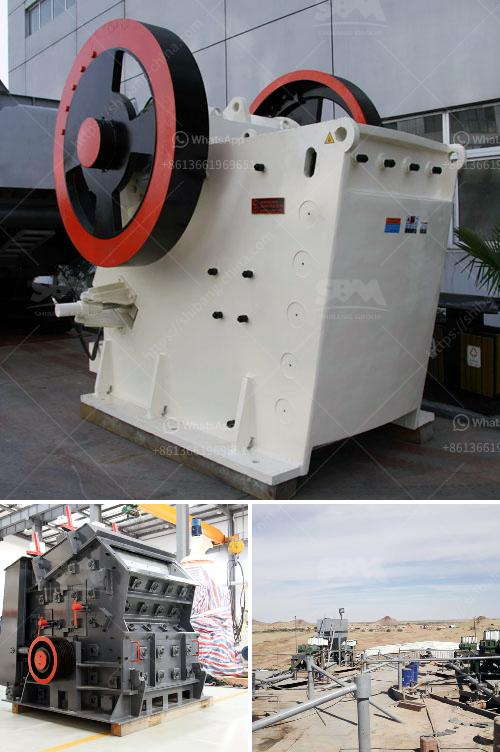

<h3>sand making stone quarry</h3>
In the world of construction and architecture, quarries serve as a vital source of raw materials. One such essential material is sand, which plays a crucial role in several industries. Sand making, the process of transforming quarried stones into sand, is a sought-after practice that maximizes the potential of quarries while simultaneously meeting the diverse needs of construction projects.

Quarrying involves extracting blocks or pieces of stone from the earth's surface to meet the demands of the construction industry. While large stones are typically used in foundations and building exteriors, smaller fractions are necessary for the production of sand. Once these smaller stones are obtained from quarries, sand making becomes the next step in the process.

Sand serves as a critical component in the production of concrete and asphalt, two primary materials utilized in construction projects. Additionally, sand is used in the manufacturing of glass, ceramics, and brick. To ensure its availability and quality, the process of making sand from quarry stones is crucial. Sand making involves crushing, screening, and washing the stones to remove impurities and create uniformly sized particles suitable for various applications.

1. Maximizing resources: Sand making allows quarries to utilize even the smallest stone fractions, thereby reducing waste and maximizing the potential of existing resources.

2. Cost-effectiveness: By creating sand from quarried stones, companies can reduce transportation costs associated with importing sand from distant locations.

3. Quality control: Making sand from quarried stones ensures a consistent quality of the material, meeting the stringent requirements of specific construction projects.

4. Environmental benefits: Sand making reduces the need for excessive excavation and, consequently, minimizes the impact on the environment. Additionally, sand created from quarried stones also helps reduce sand extraction from riverbeds, preserving fragile ecosystems.

While sand making offers numerous advantages, there are also challenges involved in the process. The availability of suitable stones, the need for advanced machinery, and adherence to environmental regulations all play a role. However, technological advancements in crushing, screening, and washing machinery have mitigated many of these challenges.

Sand making plays a vital role in stone quarries, allowing for the effective utilization of smaller stone fractions and creating a high-quality, consistent supply of sand. It not only enhances the efficiency of quarries but also contributes to cost-effectiveness, resource optimization, and environmental sustainability in the construction industry.
<h3>Contact us</h3><ul><li><strong>Whatsapp:&nbsp;<a href="https://wa.me/8613661969651">+8613661969651</a></strong></li><li><a href="https://swt.shibang-china.com/?git&amp;zhl&amp;sand making stone quarry"><strong>Online Service(chat now)</strong></a></li></ul><h3>Related</h3><ul><li><a href='price pe 600 900 stone crusher.md'>price pe 600 900 stone crusher</a></li><li><a href='gypsum processing plant.md'>gypsum processing plant</a></li><li><a href='small gold froth flotation unit.md'>small gold froth flotation unit</a></li><li><a href='conveyor belt indonesia.md'>conveyor belt indonesia</a></li><li><a href='the weight of stone crusher.md'>the weight of stone crusher</a></li></ul>