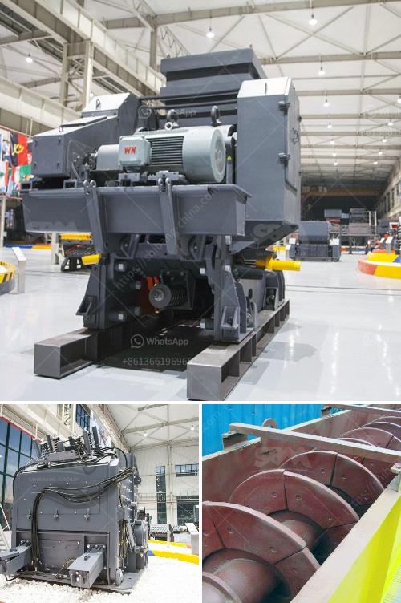

<h3>sand manufacturing machine price in tamilnadu</h3>
The sand manufacturing industry is a vital sector in the construction industry. As the demand for sand increases in the market, the need for efficient sand manufacturing machines is becoming essential. The state of Tamil Nadu is one of the largest consumers of sand in India and therefore plays a significant role in the sand manufacturing machine market.

Sand is a crucial material used in various construction activities such as concrete production, road development, and building infrastructure. Traditional methods of obtaining sand, such as riverbed mining, are no longer sustainable due to environmental concerns and the depletion of natural sand resources. This has led to the development of new technologies and machines for manufacturing sand.

In Tamil Nadu, many sand manufacturers have adopted the use of sand manufacturing machines to meet the increasing demand for sand. Sand manufacturing machines are designed to produce high-quality sand that meets the specifications and standards set by the government and construction industry. These machines consist of a rotor that crushes stones into smaller sizes, along with a conveyor belt for transporting the crushed material.

The price of sand manufacturing machines in Tamil Nadu varies depending on factors such as the capacity, brand, and specifications of the machine. Generally, a small-sized machine that produces sand from 20 to 30 tons per hour can cost around Rs. 10 lakh to Rs. 20 lakh. Larger machines with higher production capacities can cost between Rs. 30 lakh to Rs. 75 lakh. These machines come with various additional features such as dust suppression systems, automatic monitoring systems, and advanced control panels, which can further impact the price.

It is important for buyers to consider their specific requirements and budget when purchasing sand manufacturing machines. Some manufacturers in Tamil Nadu offer customized machines based on the buyer's needs, which can help optimize the production process and reduce costs in the long run. It is advisable to consult multiple manufacturers, compare prices, and thoroughly assess the features and quality of the machines before making a final decision.

Additionally, buyers should also consider the after-sales service and warranty provided by the manufacturer. Regular maintenance and occasional repairs are necessary for the smooth functioning of sand manufacturing machines. Therefore, it is crucial to choose a manufacturer who offers reliable after-sales support and readily available spare parts.

Tamil Nadu has a competitive sand manufacturing machine market with several reputed manufacturers and suppliers. Some well-known manufacturers in the state include Propel Industries, Deepa Machinery Manufacturers Pvt Ltd, and Nesans Mining and Automation Pvt Ltd. These manufacturers have established a strong reputation in the industry and are known for delivering high-quality machines with excellent performance.

In conclusion, the demand for sand manufacturing machines in Tamil Nadu is on the rise due to the increasing need for sand in the construction industry. The price of these machines varies depending on various factors such as capacity, brand, and specifications. Buyers should carefully evaluate their requirements, budget, and consider after-sales support before making a purchase. With the right sand manufacturing machine, construction projects in Tamil Nadu can meet their sand requirements efficiently and sustainably.
<h3>Contact us</h3><ul><li><strong>Whatsapp:&nbsp;<a href="https://wa.me/8613661969651">+8613661969651</a></strong></li><li><a href="https://swt.shibang-china.com/?git&amp;zhl&amp;sand manufacturing machine price in tamilnadu"><strong>Online Service(chat now)</strong></a></li></ul><h3>Related</h3><ul><li><a href='rock crushing kenya.md'>rock crushing kenya</a></li><li><a href='3tph ball mill for gold ore processing.md'>3tph ball mill for gold ore processing</a></li><li><a href='stone crusher hospital dhaka.md'>stone crusher hospital dhaka</a></li><li><a href='stone jaw crusher ppt for seminar.md'>stone jaw crusher ppt for seminar</a></li><li><a href='crusher manufacturer in pune ie.md'>crusher manufacturer in pune ie</a></li></ul>