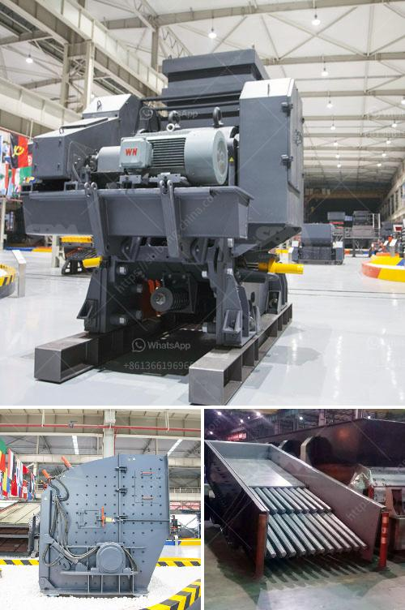

<h3>sand manufacturing plant</h3>
Sand is an essential material in the construction industry, used for various applications such as concrete production, filling, and paving. However, due to increasing demand and environmental concerns related to extracting natural sand from rivers and beaches, the construction industry has shifted towards using manufactured sand.

A sand manufacturing plant is a facility where fine particles of sand are produced by crushing hard rocks into small grains. The manufactured sand has various advantages over natural sand, including higher strength, better quality, and reduced environmental impact. Therefore, establishing a sand manufacturing plant is a sustainable solution to meet the growing demand for sand in construction.

One key aspect of a sand manufacturing plant is the crusher machine, which uses mechanical force to break rocks into smaller pieces. Once crushed, the rocks are screened to separate the desired size of sand. The plant may also include a washing unit to remove impurities from the sand and ensure its quality.

The process of manufacturing sand involves multiple stages, including primary crushing, secondary crushing, and screening. Each stage is carefully monitored to ensure consistent quality and size specifications. The final product is then stored in silos or transported for immediate use in construction projects.

By establishing a sand manufacturing plant, construction companies can reduce their dependency on natural sand, ensuring a reliable supply of high-quality sand throughout the year. Additionally, manufacturing sand locally reduces the need for transportation, further reducing the carbon footprint associated with construction activities.

Moreover, a sand manufacturing plant can address environmental concerns related to sand extraction from rivers and beaches, preventing ecological damage and safeguarding natural habitats. This sustainable approach to sand production allows for responsible development while minimizing the impact on the environment.

In conclusion, a sand manufacturing plant is an innovative solution to meet the increasing demand for sand in the construction industry. By adopting this approach, construction companies can ensure a constant supply of high-quality sand, reduce their carbon footprint, and contribute to sustainable development.
<h3>Contact us</h3><ul><li><strong>Whatsapp:&nbsp;<a href="https://wa.me/8613661969651">+8613661969651</a></strong></li><li><a href="https://swt.shibang-china.com/?git&amp;zhl&amp;sand manufacturing plant"><strong>Online Service(chat now)</strong></a></li></ul><h3>Related</h3><ul><li><a href='grinding ball for ball mills.md'>grinding ball for ball mills</a></li><li><a href='quarry crusher cost.md'>quarry crusher cost</a></li><li><a href='conveyor belt indonesia.md'>conveyor belt indonesia</a></li><li><a href='limestone crusher plant tph.md'>limestone crusher plant tph</a></li><li><a href='crusher manufacturers in hyderabad.md'>crusher manufacturers in hyderabad</a></li></ul>