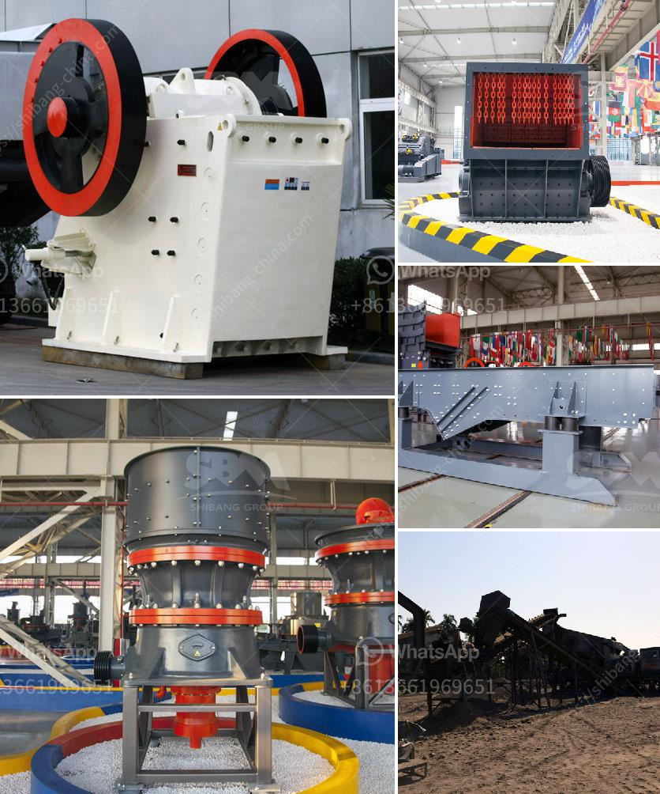

<h3>sand screening machine</h3>
The sand screening machine is a mechanical device used to separate materials like soil, gravel, and sand, especially raw materials that are not ready for use in construction sites. This device helps in eliminating impurities while also improving the quality of sand. It consists of a vibrating screen that uses mechanical vibrations to remove unwanted material. In this article, we will discuss the features, uses, and benefits of the sand screening machine.

One of the essential features of the sand screening machine is its ability to separate different types of materials. It can efficiently process materials like sand, gravel, crushed stones, and even raw construction materials. This is possible because of the vibrating screen's size and design, which allow for easy separation of materials based on their size and texture.

The uses of the sand screening machine are vast and varied. It is commonly used in construction sites, where it helps in sorting different types of materials for various purposes. For example, the machine can remove large stones or debris from sand, making it suitable for use in concrete production. It also aids in the separation of different sizes of sand particles, ensuring that only the desired size is used in specific construction projects.

Another benefit of the sand screening machine is its ability to improve the quality of sand. By removing impurities like stones, dust, and foreign objects, this device ensures that the resulting sand is of a higher quality. The high-quality sand is essential for achieving stronger and more durable construction projects. It also reduces the chances of the materials corroding or deteriorating over time.

Moreover, the sand screening machine is easy to operate and maintain, making it a popular choice among construction workers. It requires minimal training to operate and does not involve complex procedures. Regular maintenance, such as cleaning the screen and repairing any damages, can prolong the machine's lifespan and maintain its efficiency.

The machine's efficiency is also noteworthy. It can process large volumes of materials within a short period, saving time and effort for construction workers. This not only increases productivity but also helps in meeting project deadlines. The adjustable vibrating screen settings allow for customization according to specific project requirements.

Furthermore, the sand screening machine is designed with durability in mind. It is built to withstand harsh conditions and heavy usage, ensuring that it can withstand the demands of construction sites. Proper care and regular maintenance can extend its lifespan, resulting in long-term cost savings for construction companies.

In conclusion, the sand screening machine is an essential tool in the construction industry. It helps in separating various types of materials, improving the quality of sand, and ensuring efficient operations at construction sites. Its ease of use, low maintenance requirements, and durability make it a valuable asset for construction companies. Investing in a reliable sand screening machine can lead to cost savings, improved productivity, and enhanced project outcomes.
<h3>Contact us</h3><ul><li><strong>Whatsapp:&nbsp;<a href="https://wa.me/8613661969651">+8613661969651</a></strong></li><li><a href="https://swt.shibang-china.com/?git&amp;zhl&amp;sand screening machine"><strong>Online Service(chat now)</strong></a></li></ul><h3>Related</h3><ul><li><a href='feasibility study of cement plant.md'>feasibility study of cement plant</a></li><li><a href='silica sand washing plant china.md'>silica sand washing plant china</a></li><li><a href='hammer mill diagram.md'>hammer mill diagram</a></li><li><a href='sandstone sand making machine manufacturer.md'>sandstone sand making machine manufacturer</a></li><li><a href='diagram of a hammer mill.md'>diagram of a hammer mill</a></li></ul>