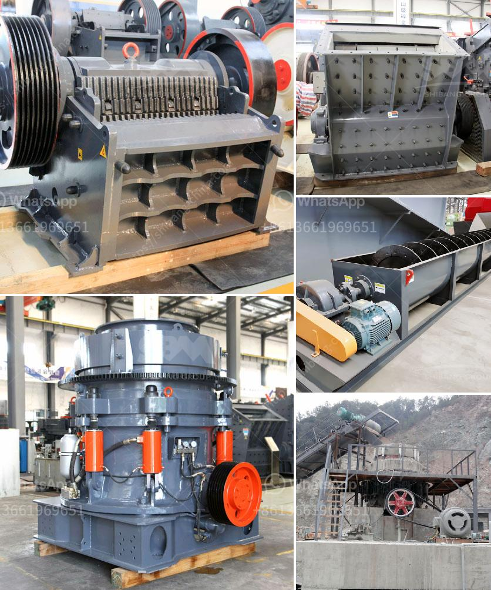

<h3>sand sieve machine</h3>
A sand sieve machine is a device that can help to separate different sized materials in various applications such as landscaping, construction, mining, and agriculture. The sieve machine consists of a hopper, a vibrating motor, a drum sieve, and a mesh. It can efficiently sieve the materials into different sizes.

One of the primary uses of a sand sieve machine is to separate gravel, sand, and other aggregates. People working in the field of road construction, building construction, landscaping, and mining are frequently required to sort materials of different sizes. A manual method of separating materials can be time-consuming and ineffective. That's where a sand sieve machine comes in handy.

The machine comprises a hopper that allows the materials to be fed into the drum sieve. The vibrating motor is responsible for providing the necessary vibration to facilitate the separation process. As the machine vibrates, the materials move through the mesh, allowing finer particles to pass through and larger ones to stay on top.

The size of the mesh on the drum sieve can vary depending on the application. The user can choose a mesh size that suits their needs, ensuring that only the desired sizes of materials pass through. This versatility makes the machine suitable for a wide range of applications.

In the construction industry, the sand sieve machine can be used to separate sand and gravel. Sand is an essential component of concrete, and by separating it from gravel, builders ensure that the mix has the correct proportions of materials. This helps to improve the strength and durability of the resulting concrete structures.

In the mining industry, a sand sieve machine can be used to separate minerals and other valuable resources from waste materials. This allows for efficient extraction and processing of minerals, reducing the need for manual sorting and increasing overall productivity.

Landscapers also benefit from using a sand sieve machine. They can quickly separate different sizes of soil, gravel, pebbles, and sand to create aesthetically pleasing designs. By using the machine, landscapers can save time and effort, allowing them to focus on other aspects of their work.

Agriculture is another sector where a sand sieve machine can be useful. Farmers can sieve out impurities, stones, and other debris from soil so that it is suitable for planting. By ensuring the soil is clean, farmers can improve plant growth and increase crop yield.

In conclusion, a sand sieve machine is a versatile tool that can be used in various industries. By efficiently sorting different sizes of materials, it helps to improve productivity and quality. Whether it's in construction, mining, landscaping, or agriculture, the sand sieve machine has proven to be an invaluable asset. Its ability to separate materials according to their sizes makes it an essential tool for anyone working with different types of materials.
<h3>Contact us</h3><ul><li><strong>Whatsapp:&nbsp;<a href="https://wa.me/8613661969651">+8613661969651</a></strong></li><li><a href="https://swt.shibang-china.com/?git&amp;zhl&amp;sand sieve machine"><strong>Online Service(chat now)</strong></a></li></ul><h3>Related</h3><ul><li><a href='pebble crushing plant.md'>pebble crushing plant</a></li><li><a href='mobile crushing plant in peru.md'>mobile crushing plant in peru</a></li><li><a href='gypsum mill production.md'>gypsum mill production</a></li><li><a href='barite grinding machine manufacturer.md'>barite grinding machine manufacturer</a></li><li><a href='how much does gold mining licences in nigeria.md'>how much does gold mining licences in nigeria</a></li></ul>