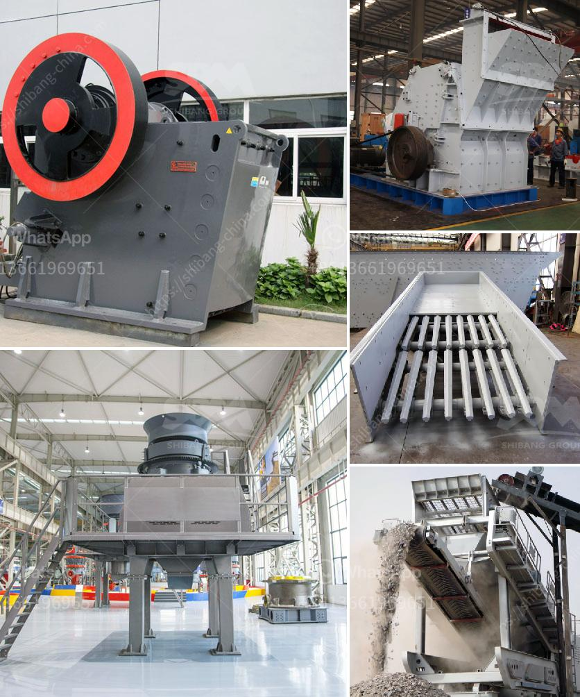

<h3>sand washing machine lsx</h3>
The sand washing machine LSX refers to the type of equipment used in the industry to clean and wash sand materials. It is a robust and highly efficient equipment that is suitable for various types of materials, such as construction sand and road construction sand.

One of the key features of the LSX sand washing machine is its high washing efficiency. It is equipped with an advanced washing system that can remove impurities, such as dust, clay, and dirt, from the sand materials. The machine uses water and chemicals to wash and clean the sand, which ensures that the final product is of high quality and suitable for use in various applications.

Another notable feature of the LSX sand washing machine is its low power consumption. It is designed to operate with high efficiency while consuming minimal energy. This not only helps in reducing energy costs but also makes it an environmentally friendly choice for sand washing operations. The machine is also designed to be durable and long-lasting, which further adds to its cost-effectiveness.

The LSX sand washing machine is also easy to operate and maintain. It is equipped with a user-friendly control panel that allows operators to adjust various settings and monitor the washing process. The machine also has a self-cleaning function that helps in reducing manual cleaning and maintenance efforts. This ease of operation and maintenance makes it a preferred choice for many sand washing operators.

One of the main advantages of using the LSX sand washing machine is the improved quality of the sand materials. The machine effectively removes impurities and contaminants from the sand, which results in cleaner and more consistent sand particles. This is crucial in many industries, such as construction and concrete production, as it ensures that the end product meets the required standards and specifications.

In addition to improved sand quality, the LSX sand washing machine also helps in enhancing the overall productivity of sand washing operations. It has a larger capacity and faster washing speed compared to traditional manual methods. This allows operators to process a larger volume of sand materials in a shorter period, thereby increasing efficiency and reducing production time.

Overall, the LSX sand washing machine has become a popular choice for sand washing operations across different industries. Its high washing efficiency, low power consumption, easy operation and maintenance, and improved sand quality make it a reliable and cost-effective solution. Whether it is for construction, road construction, or other sand washing applications, the LSX sand washing machine proves to be an efficient and reliable choice.
<h3>Contact us</h3><ul><li><strong>Whatsapp:&nbsp;<a href="https://wa.me/8613661969651">+8613661969651</a></strong></li><li><a href="https://swt.shibang-china.com/?git&amp;zhl&amp;sand washing machine lsx"><strong>Online Service(chat now)</strong></a></li></ul><h3>Related</h3><ul><li><a href='hydraulic concrete crusher rent mn.md'>hydraulic concrete crusher rent mn</a></li><li><a href='stone crushers in botswana.md'>stone crushers in botswana</a></li><li><a href='gold washing plant colombia.md'>gold washing plant colombia</a></li><li><a href='screen vibrating screen for sand.md'>screen vibrating screen for sand</a></li><li><a href='slag grinding mill.md'>slag grinding mill</a></li></ul>