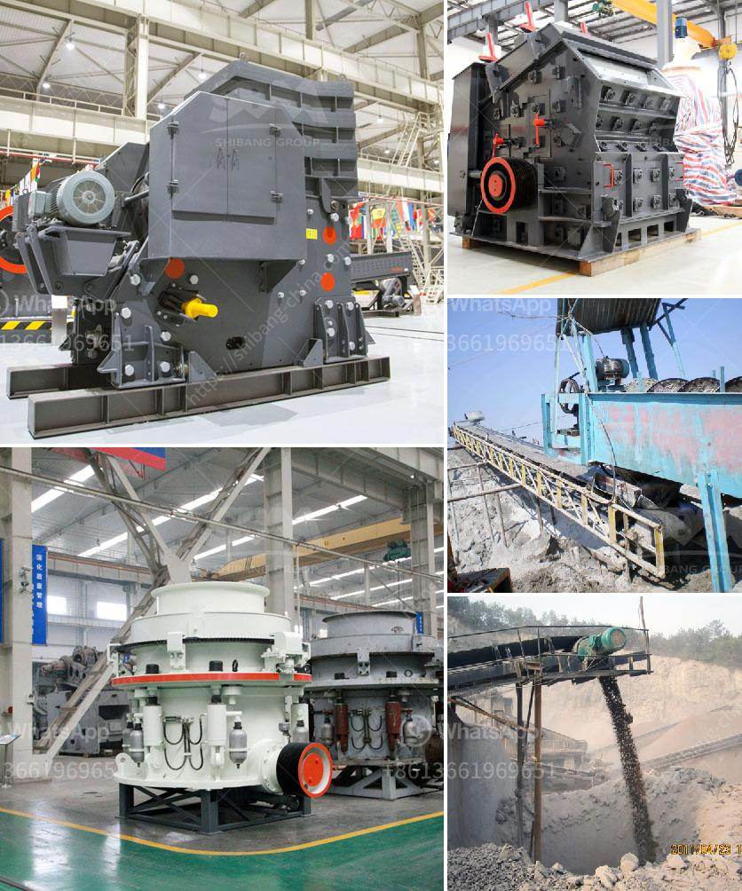

<h3>sand washing machine saudi</h3>
Sand washing machine, also known as sand washer, is a machine used to remove impurities from sand to improve its quality and usability. It is widely used in various industries such as construction, sand and gravel, mining, and many more. Saudi Arabia, a country rich in oil and minerals, is a promising market for sand washing machines. With the rapid development of infrastructure in the kingdom, demand for sand has been increasing.

The sand washing machine saudi is a versatile equipment capable of performing multiple tasks. It can wash, dewater, and classify the sand particles, making it suitable for a variety of applications. The machine relies on the principle of mechanical agitation to remove impurities such as dirt, clay, and mud from sand. The stirring blades inside the machine rotate and mix the sand, water, and impurities, causing them to detach from the sand grains. The impurities are then carried away by the water, while the clean sand is discharged through the outlet.

One of the notable features of the sand washing machine in Saudi Arabia is its efficiency. It can process large volumes of sand in a short period, enabling companies to meet the demands of their clients timely. The machine's efficiency is further enhanced by its advanced technology and design, which optimize the washing process and minimize water and energy consumption. This not only saves resources but also reduces operating costs for businesses.

Apart from its efficiency, the sand washing machine in Saudi Arabia also offers environmental benefits. The machine is equipped with a water recycling system, which allows it to recycle and reuse water during the washing process. This significantly reduces the water consumption, conserving this precious resource. Additionally, the recycling process also minimizes the discharge of wastewater into the environment, reducing the impact on local water bodies.

The sand washing machine saudi is also designed to minimize the emission of dust and other harmful particles into the air. It is equipped with a dust control system that captures and filters airborne particles generated during the washing process. This helps in maintaining a healthy working environment for operators and prevents pollution of the surrounding air.

The sand washing machine saudi is undoubtedly a valuable asset for businesses in Saudi Arabia's construction and mining industries. Its versatility, efficiency, and environmental benefits make it an ideal choice for sand washing applications. Investing in this machine can help companies meet the increasing demand for sand and improve the quality of their products. With its advanced technology and design, the machine ensures effective washing, minimal water and energy consumption, and reduced environmental impact. All these factors contribute to the sustainable development of the kingdom's construction industry.
<h3>Contact us</h3><ul><li><strong>Whatsapp:&nbsp;<a href="https://wa.me/8613661969651">+8613661969651</a></strong></li><li><a href="https://swt.shibang-china.com/?git&amp;zhl&amp;sand washing machine saudi"><strong>Online Service(chat now)</strong></a></li></ul><h3>Related</h3><ul><li><a href='density of fine aggregate granite.md'>density of fine aggregate granite</a></li><li><a href='how to use hammer mill.md'>how to use hammer mill</a></li><li><a href='crusher manufacturer in pune ie.md'>crusher manufacturer in pune ie</a></li><li><a href='philippines stone crusher.md'>philippines stone crusher</a></li><li><a href='iron processing plant cost.md'>iron processing plant cost</a></li></ul>