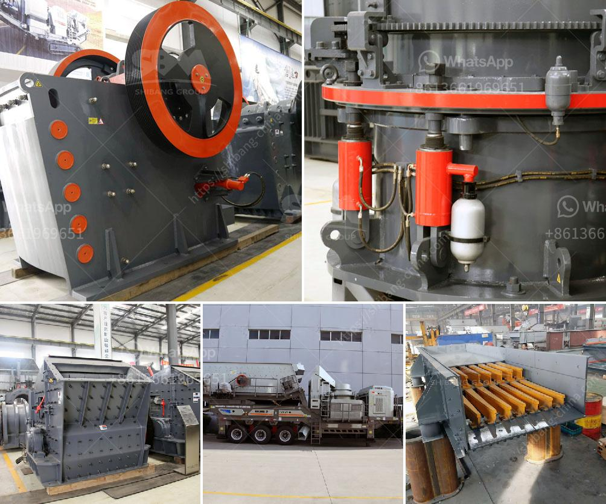

<h3>sand washing plant saudi arabia</h3>
Sand washing plant is a common machine in Saudi Arabia for washing sand, especially the 100-300 tons per hour capacity. It integrates sand washing, dehydration, and recovery, utilizing cutting-edge technology to improve efficiency. The plant can efficiently complete sand cleaning, washing, and separating processes by utilizing water. It produces high-quality sand, which can be widely used in construction, road building, and other industries.

The sand washing plant consists of a vibrating feeder, a jaw crusher, a sand making machine, a vibrating screen, a sand washing machine, and an integrated electronic control system. Its simple structure, stable performance, and high productivity make it an indispensable equipment in the sand production line.

The sand washing plant efficiently removes impurities such as dust, dirt, and silica particles from the sand. The clean sand is then dehydrated to achieve a moisture content suitable for use. The plant also recovers fine sand lost during the washing process, thus increasing the overall output.

Saudi Arabia, with its vast coastline along the Red Sea and the Arabian Gulf, has a large demand for high-quality sand in various industries. The sand washing plant is beneficial to the construction sector, as it provides clean sand that meets the required specifications for concrete and asphalt production. Additionally, it helps in reducing the environmental impact caused by mining natural sand.

The sand washing plant in Saudi Arabia is not limited to just sand washing, but it also includes dewatering and recycling of waste water. Thus, fulfilling the requirements of environmental protection and resource conservation. The main priority of the plant is to provide a high-quality sand product to various clients, ensuring their satisfaction and repeat business.

In conclusion, the sand washing plant in Saudi Arabia is a necessary equipment in the sand production line, which we cannot ignore. Indeed, it plays an important role in producing high-quality sand efficiently and reducing environmental pollution. Its broad application in the construction industry contributes significantly to the economic development of Saudi Arabia.
<h3>Contact us</h3><ul><li><strong>Whatsapp:&nbsp;<a href="https://wa.me/8613661969651">+8613661969651</a></strong></li><li><a href="https://swt.shibang-china.com/?git&amp;zhl&amp;sand washing plant saudi arabia"><strong>Online Service(chat now)</strong></a></li></ul><h3>Related</h3><ul><li><a href='washing plant mining prices.md'>washing plant mining prices</a></li><li><a href='buy stone quarry crusher equipment from europe.md'>buy stone quarry crusher equipment from europe</a></li><li><a href='jaw crusher for barite crushing.md'>jaw crusher for barite crushing</a></li><li><a href='project report on m sand.md'>project report on m sand</a></li><li><a href='talcum powder grinding machine in kerala.md'>talcum powder grinding machine in kerala</a></li></ul>