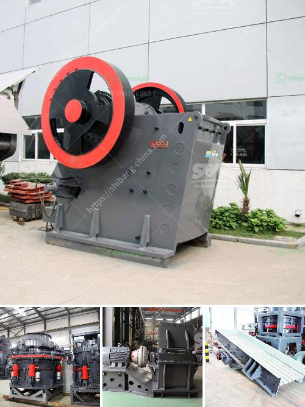

<h3>sand washing plant south africa</h3>
Sand washing plant south Africa is an essential piece of equipment for sand producers in the country. Sand washing plant is used to wash and segregate sand from gravel or soil, and is an essential component of sand production line.

The sand is processed through a series of washing and screening stages before it is ready to be used in construction projects. The sand washing plant is designed with a capacity of 100 to 200 tons per hour.

Low power consumption and minimal water loss are two key features of sand washing plants in South Africa. They are particularly applicable to washing good quality sand for construction and oil well backfill.

Sand washing plant machines are engineered to perform and built for decades of service. In a sand treatment plant, sand washing equipment is the main part, which pushes the stone material into the sand washing machine. After a preliminary cleaning, the stone materials are sent into the sand washing machine for further cleaning or dewatering.

The sand washing plant needs to match the feeding material’s capacity, processing capacity, and other requirements. Working principles of sand washing plants are as follows: the sand and gravels flow into washing chute from feeding launder, rolls with the impeller, and grinds each other. The impurity covering the sand is washed away. At the same time, the water is added with a strong water flow to take away the impurities that were removed from the sand. 

Sand washing plants work on a continuous feed system whereby the sand particles are harnessed to the plant’s drive drum via a bucket elevator, they are then washed through a trickle feed of water to remove any brittleness. 

Additionally, sand washing plant South Africa offers a perfect method for recovery and dewatering sand. The tailings are covered. After complete settlement, they are discharged slowly and transported to a designated area by a belt conveyor. 

Sand washing plants in South Africa provide low water consumption and low strength. It can reduce the disorganized mud, produce reasonable waste residue discharge, and achieve cost-effective lightweight and water-saving.

The sand produced by the sand washing plant can serve as concrete sand and building sand, which can be used in construction sites, with a wide range of applications. In addition, the sand washing plant has the value of environmental protection by reducing the water consumption, avoiding the pollution generated in the process of came-out sand.

To sum up, the sand washing plant South Africa is used to wash and segregate sand from gravel or soil. It can produce high-quality sand and gravel, which can be used in various construction projects. The sand washing plants are designed with low power consumption and minimal water loss. They are durable and reliable, making them an essential piece of equipment for sand producers in South Africa.
<h3>Contact us</h3><ul><li><strong>Whatsapp:&nbsp;<a href="https://wa.me/8613661969651">+8613661969651</a></strong></li><li><a href="https://swt.shibang-china.com/?git&amp;zhl&amp;sand washing plant south africa"><strong>Online Service(chat now)</strong></a></li></ul><h3>Related</h3><ul><li><a href='cost of granite crusher.md'>cost of granite crusher</a></li><li><a href='belt conveyor supplier in china.md'>belt conveyor supplier in china</a></li><li><a href='clinker processing line in germany.md'>clinker processing line in germany</a></li><li><a href='100tph stone crusher sale in south africa.md'>100tph stone crusher sale in south africa</a></li><li><a href='crusher machine kenya.md'>crusher machine kenya</a></li></ul>