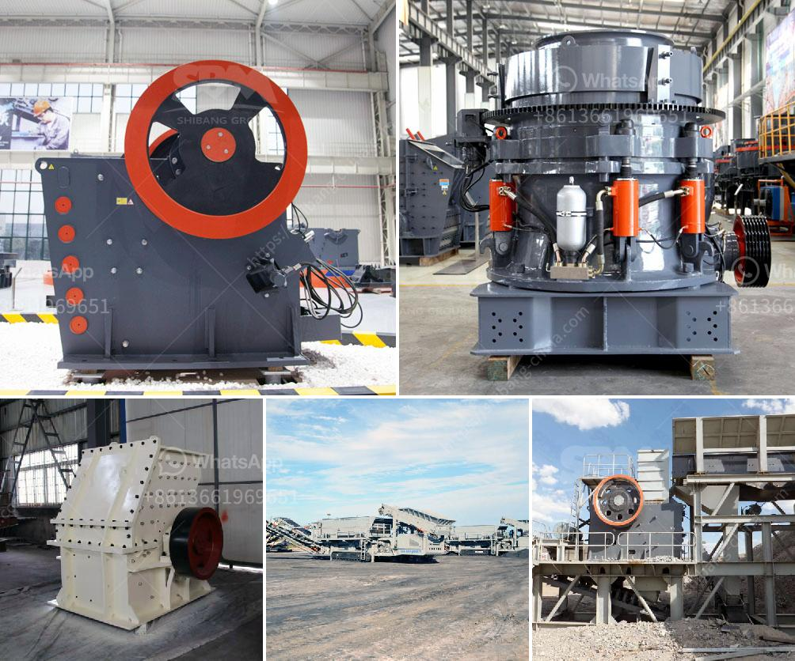

<h3>sand washinng plant makers in srilanka</h3>
As the demand for quality construction sand continues to rise, Sri Lanka has seen a significant increase in the establishment of sand washing plants in the country. These plants play a crucial role in producing clean and usable sand that meets the stringent requirements of the construction industry. In this article, we will explore some of the leading sand washing plant makers in Sri Lanka and their contributions to this vital industry.

C.A. Crushing Pvt Ltd is a prominent manufacturer of high-quality sand washing plants in Sri Lanka. The company designs and manufactures innovative equipment to enhance the production of superior sand products. With an experienced and dedicated team, C.A. Crushing Pvt Ltd has successfully delivered a range of sand washing plants to both local and international clients. Their plants are known for their efficiency, durability, and excellent performance.

YONG WON Lanka (Pvt) Ltd is a renowned manufacturer of sand washing plants catering to the needs of the local construction industry. Their sand washing plants are designed to efficiently remove impurities from sand, ensuring a consistent supply of high-quality construction materials. YONG WON Lanka (Pvt) Ltd places great emphasis on environmental sustainability, incorporating state-of-the-art water recycling systems in their plants to minimize water wastage.

Samanmalie Metal Crusher & Sand Plant is a trusted name when it comes to sand washing plants in Sri Lanka. The company manufactures and supplies high-quality sand products for the local construction industry, while also exporting to international markets. They utilize advanced technology in their sand washing plants, resulting in superior cleaning and grading of sand particles. Samanmalie Metal Crusher & Sand Plant is committed to providing sustainable solutions to meet the growing demand for construction sand.

Bitumin Lanka Metal Crusher is an experienced manufacturer of sand washing plants, providing high-quality sand products to meet the demands of the local construction industry. The company's sand washing plants are equipped with advanced machinery and technology to efficiently wash and grade sand particles. With a strong focus on quality control, Bitumin Lanka Metal Crusher ensures that their sand products consistently meet industry standards.

Sri Lanka's construction industry heavily relies on sand washing plants to produce high-quality construction sand. These plants are designed and manufactured by several leading companies in the country, including C.A. Crushing Pvt Ltd, YONG WON Lanka (Pvt) Ltd, Samanmalie Metal Crusher & Sand Plant, and Bitumin Lanka Metal Crusher. With their commitment to excellence, these companies are playing a crucial role in meeting the increasing demand for construction materials.

The sand washing plants manufactured by these companies not only ensure the availability of clean and usable sand but also prioritize environmental sustainability. Their ability to integrate state-of-the-art water recycling systems in their plants reflects their commitment to reducing water wastage and preserving the environment.

As Sri Lanka's construction industry continues to grow, the importance of sand washing plants cannot be overstated. These manufacturers are instrumental in the production of quality sand, making a significant contribution to the development of the nation's infrastructure. Working together, they are driving innovation and meeting the demands of the ever-expanding construction sector.
<h3>Contact us</h3><ul><li><strong>Whatsapp:&nbsp;<a href="https://wa.me/8613661969651">+8613661969651</a></strong></li><li><a href="https://swt.shibang-china.com/?git&amp;zhl&amp;sand washinng plant makers in srilanka"><strong>Online Service(chat now)</strong></a></li></ul><h3>Related</h3><ul><li><a href='second hand ball mill europe.md'>second hand ball mill europe</a></li><li><a href='list of used machines coal mining.md'>list of used machines coal mining</a></li><li><a href='conveyor belts in port system.md'>conveyor belts in port system</a></li><li><a href='setting up of a stone quarry plant in nigeria.md'>setting up of a stone quarry plant in nigeria</a></li><li><a href='diamond stone crusher price list.md'>diamond stone crusher price list</a></li></ul>