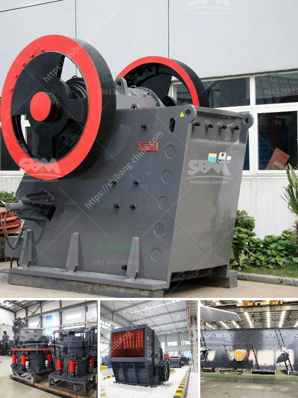

<h3>sandstone sand making machine manufacturer</h3>
Sandstone is a popular construction material that has been used for centuries due to its durability and aesthetic appeal. In recent years, the demand for sandstone has increased significantly, leading to the development of advanced sandstone sand making machines.

One of the leading manufacturers in the industry is known for producing state-of-the-art sandstone sand making machines that are widely used in various construction projects. These machines are designed to crush and shape sandstone to produce high-quality sand, which is widely used in the construction industry for various purposes.

The sandstone sand making machines manufactured by this company are highly efficient and environmentally friendly. They are equipped with advanced technology that ensures the production of sand of the highest quality. These machines are capable of producing sand in different sizes and shapes, catering to the specific requirements of various construction projects.

One of the key features of these machines is their ability to crush sandstone into a fine powder, which can then be used to manufacture various construction products. This process helps in reducing waste and optimizing the utilization of sandstone, making it an eco-friendly option for construction projects.

The sandstone sand making machines manufactured by this company are also known for their durability and reliability. They are made from high-quality materials that ensure long-term performance and low maintenance costs. The machines are designed to withstand the harsh conditions of construction sites, ensuring that they can work efficiently even in challenging environments.

Furthermore, the company offers excellent after-sales services, ensuring that their customers receive timely assistance and support. They have a team of highly skilled technicians who are available to provide technical guidance and resolve any issues that may arise with the machines. This ensures that customers can use their sandstone sand making machines without any disruption or downtime, maximizing productivity and efficiency.

In addition to manufacturing sandstone sand making machines, this company also provides comprehensive solutions for construction projects. They offer a wide range of equipment and services, including installation, training, and maintenance. This ensures that customers can rely on them for all their sandstone-related requirements, making them a one-stop solution for construction projects.

Overall, the sandstone sand making machine manufacturer is dedicated to providing its customers with high-quality machines that meet their specific needs. Their commitment to innovation, quality, and customer satisfaction has made them a trusted name in the construction industry. With their advanced technology and excellent services, they continue to set new standards in the sandstone sand making machine manufacturing industry.
<h3>Contact us</h3><ul><li><strong>Whatsapp:&nbsp;<a href="https://wa.me/8613661969651">+8613661969651</a></strong></li><li><a href="https://swt.shibang-china.com/?git&amp;zhl&amp;sandstone sand making machine manufacturer"><strong>Online Service(chat now)</strong></a></li></ul><h3>Related</h3><ul><li><a href='iron ore upgrading plant equipment.md'>iron ore upgrading plant equipment</a></li><li><a href='grinder machine for quartz.md'>grinder machine for quartz</a></li><li><a href='gypsum processing plant.md'>gypsum processing plant</a></li><li><a href='jaw crusher price capacity.md'>jaw crusher price capacity</a></li><li><a href='price phosphate rock crusher.md'>price phosphate rock crusher</a></li></ul>