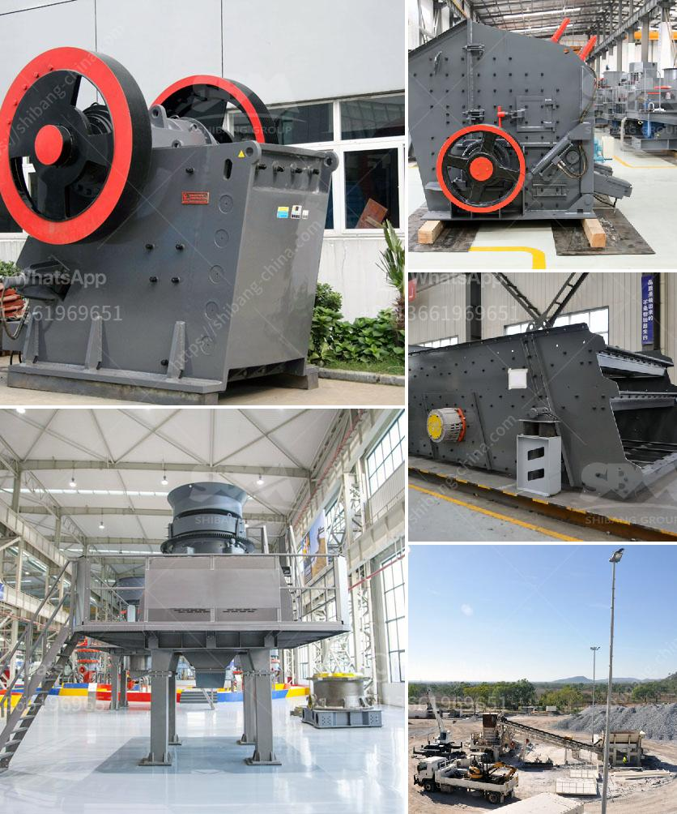

<h3>sayaji jaw crusher x specifiion</h3>
When it comes to buying a dependable crusher for your business needs, Sayaji Jaw Crusher X Specification stands out among the rest. Renowned for its incredible durability, efficiency, and reliable performance, this crusher solution surpasses industry standards. With its robust construction and state-of-the-art features, the Sayaji Jaw Crusher X Specification is specially designed to handle even the toughest materials, making it an ideal choice for diverse applications.

The Sayaji Jaw Crusher X Specification boasts a heavy-duty design that ensures its longevity and durability even in the harshest working environments. Its sturdy frame is made of high-quality steel, which is resistant to corrosion and can withstand heavy loads. This construction guarantees that the crusher can handle the hardest stones, rocks, ores, or concrete, ensuring consistent performance over time.

One of the key features of the Sayaji Jaw Crusher X Specification is its powerful jaw plates. These plates are designed to provide maximum crushing capacity and optimize the crushing process. The high-quality manganese steel used in these jaw plates ensures excellent wear resistance and extends their lifespan, reducing the need for frequent replacements.

With its adjustable settings, the Sayaji Jaw Crusher X Specification allows operators to tailor the output size of the crushed material to their specific needs. This flexibility makes it a versatile tool for a wide range of applications, such as mining, construction, demolition, and recycling. Whether you need to produce fine aggregates or coarse particles, this crusher can easily adapt to your requirements.

Furthermore, the Sayaji Jaw Crusher X Specification is equipped with advanced technology that enhances its performance. The hydraulic system ensures smooth operation and prevents the crusher from overload damage. Additionally, the integrated motor and gearbox provide optimal power transmission, maximizing energy efficiency and reducing operating costs.

Safety is a paramount consideration in every crusher, and the Sayaji Jaw Crusher X Specification does not compromise on it. The machine is equipped with various safety features, such as a protective enclosure, emergency stops, and safety guards, to prevent accidents and ensure a secure working environment.

Maintenance and servicing are essential to keep any machinery running smoothly, and the Sayaji Jaw Crusher X Specification offers hassle-free maintenance. Its user-friendly design allows for quick and easy access to critical components, simplifying inspection and replacement of parts. Moreover, the crusher's modular structure enables swift assembly and disassembly, reducing downtime and increasing productivity.

In conclusion, the Sayaji Jaw Crusher X Specification is a premier crusher solution that delivers exceptional performance, reliability, and versatility. Its robust construction, powerful jaw plates, and advanced technology make it an ideal choice for various industries, from quarrying and mining to construction and recycling. With its outstanding durability and efficiency, this crusher solution ensures that your operations run smoothly and consistently, giving you a competitive edge in the market. Invest in the Sayaji Jaw Crusher X Specification, and experience the difference in your crushing operations.
<h3>Contact us</h3><ul><li><strong>Whatsapp:&nbsp;<a href="https://wa.me/8613661969651">+8613661969651</a></strong></li><li><a href="https://swt.shibang-china.com/?git&amp;zhl&amp;sayaji jaw crusher x specifiion"><strong>Online Service(chat now)</strong></a></li></ul><h3>Related</h3><ul><li><a href='impact crusher machine.md'>impact crusher machine</a></li><li><a href='silica water washing plant price.md'>silica water washing plant price</a></li><li><a href='iron ore upgrading plant equipment.md'>iron ore upgrading plant equipment</a></li><li><a href='coal mining equipment manufacturers in south africa.md'>coal mining equipment manufacturers in south africa</a></li><li><a href='types of ball mill machine for gold.md'>types of ball mill machine for gold</a></li></ul>