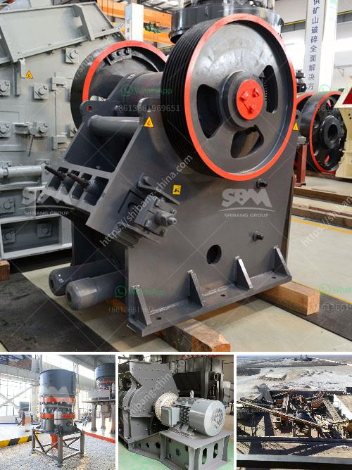

<h3>scale copper ore processing equipment for sale congo</h3>
Copper ore is a valuable mineral resource that is widely mined and utilized worldwide. The demand for copper is constantly increasing due to its wide range of applications in various industries, such as construction, electronics, and transportation. In the Democratic Republic of Congo (DRC), one of the largest copper-producing countries in the world, there is a growing need for efficient and affordable copper ore processing equipment.

Copper ore processing equipment plays a crucial role in the copper mining process. First, copper ore is extracted from the mine and transported to the beneficiation plant, where it is crushed, screened, and undergoes a series of physical and chemical processes to remove the unwanted impurities and produce a saleable copper concentrate. The processing equipment used in this process varies depending on the scale of the operation.

For small-scale copper mining operations in Congo, such as those in artisanal and small-scale mining (ASM) communities, there is a need for low-cost and portable equipment that can be easily maintained and operated. This equipment should also be environmentally friendly and have a minimal impact on the surrounding ecosystems. 

Various types of equipment have been developed to cater to the needs of small-scale copper mining operations. These include portable crushers, gravity concentrators, and flotation machines. These machines are designed to process smaller quantities of copper ore efficiently and effectively, enabling small-scale miners to increase their production while minimizing costs.

In addition to small-scale equipment, larger-scale copper mining operations in Congo require more advanced processing equipment. These operations typically include open-pit mining and large-scale beneficiation plants. Equipment such as jaw crushers, ball mills, flotation machines, and thickening equipment are commonly used in these operations to process large quantities of copper ore to meet the high demand.

In conclusion, the scale of copper ore processing equipment used in Congo varies depending on the size of the mining operation. From small-scale equipment suitable for ASM communities to larger-scale equipment used in large-scale mining operations, there is a wide range of equipment available to meet the diverse needs of the copper mining industry in Congo. Investing in efficient and cost-effective equipment is crucial for the sustainable growth and development of the copper mining sector in Congo.
<h3>Contact us</h3><ul><li><strong>Whatsapp:&nbsp;<a href="https://wa.me/8613661969651">+8613661969651</a></strong></li><li><a href="https://swt.shibang-china.com/?git&amp;zhl&amp;scale copper ore processing equipment for sale congo"><strong>Online Service(chat now)</strong></a></li></ul><h3>Related</h3><ul><li><a href='iron processing equipment.md'>iron processing equipment</a></li><li><a href='set up a quarry for ballast stones south africa.md'>set up a quarry for ballast stones south africa</a></li><li><a href='cement production procedure in vertical mill.md'>cement production procedure in vertical mill</a></li><li><a href='cobble stone machine nigeria.md'>cobble stone machine nigeria</a></li><li><a href='talc powder plant.md'>talc powder plant</a></li></ul>