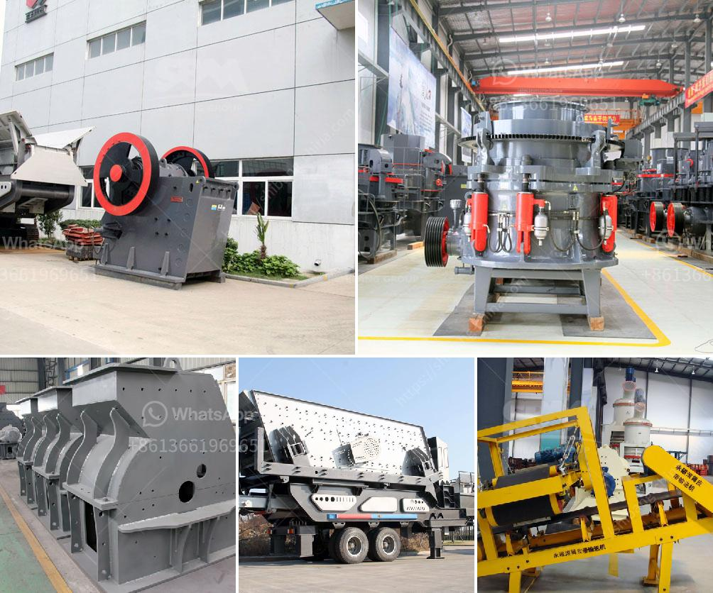

<h3>schenck weighbelt feeders calibration procedure</h3>
Schenck Weighbelt feeders are widely used in various industries, providing precise and reliable feeding solutions. However, to maintain their accuracy and performance, regular calibration is essential. Calibration is a process of verifying and adjusting the accuracy of a weighing system, ensuring that it measures weight correctly.

The calibration procedure for Schenck Weighbelt feeders involves several crucial steps. Firstly, it is important to ensure that the equipment is in proper working condition. This includes checking for any physical damage or wear and tear that may affect its performance. It is also necessary to examine the load cells and evaluate their sensitivity.

The next step in the calibration procedure is to verify the correct zero and span settings. Zero is the value displayed when there is no load on the weighing system, while span defines the maximum load capacity. By setting the zero and span correctly, the feeders can accurately measure various weights within their capacity range.

Once the zero and span settings are established, it is crucial to conduct material tests. This involves feeding known quantities of pre-weighed materials through the system and comparing the measured values with the expected values. Any discrepancies can be addressed by adjusting the calibration settings.

In addition to material tests, regular performance tests are recommended to ensure consistent accuracy. These tests involve subjecting the feeders to different load conditions and measuring the output. This helps identify any potential issues or inaccuracies in the system, allowing for prompt maintenance and adjustments.

The calibration procedure for Schenck Weighbelt feeders also includes regular maintenance and cleaning. Keeping the equipment clean and well-maintained not only improves performance but also extends its lifespan. It is important to follow manufacturer guidelines and recommendations for routine maintenance tasks.

Overall, calibration is an essential aspect of maintaining the accuracy and reliability of Schenck Weighbelt feeders. By conducting regular calibration procedures, industries can ensure precise weighing measurements, minimize errors, and optimize productivity. It is advisable to seek the assistance of professionals or follow the manufacturer's guidelines to ensure proper calibration and accurate results.
<h3>Contact us</h3><ul><li><strong>Whatsapp:&nbsp;<a href="https://wa.me/8613661969651">+8613661969651</a></strong></li><li><a href="https://swt.shibang-china.com/?git&amp;zhl&amp;schenck weighbelt feeders calibration procedure"><strong>Online Service(chat now)</strong></a></li></ul><h3>Related</h3><ul><li><a href='stone crusher mesh size.md'>stone crusher mesh size</a></li><li><a href='drywall grinding for gypsum.md'>drywall grinding for gypsum</a></li><li><a href='chain crusher chain crusher suppliers and.md'>chain crusher chain crusher suppliers and</a></li><li><a href='difference between chain and belt conveyors.md'>difference between chain and belt conveyors</a></li><li><a href='process of making silica sand.md'>process of making silica sand</a></li></ul>