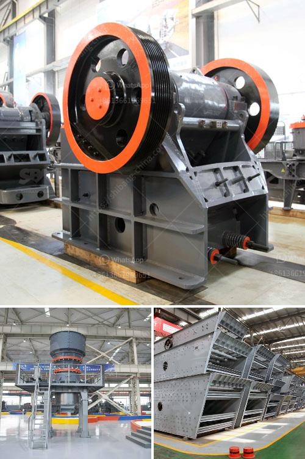

<h3>screen vibrating screen for sand</h3>
A vibrating screen is a machine that separates materials by size and eliminates unwanted debris. It utilizes a vibrating motor to induce vibrations that help separate the materials as they pass through the screen. Vibrating screens are commonly used in the mining, construction, and sand production industries to separate materials of different sizes.

In particular, vibrating screens for sand are used extensively for sand classification and separation. Sand screens have a wide variety of applications, ranging from screening, dewatering, and scalping to fines recovery and compost production. They are designed to withstand extreme conditions, including high temperatures, heavy loads, and abrasive materials.

One of the primary advantages of a vibrating screen for sand is its efficiency in particle separation. With multiple decks and use of different mesh sizes, it can accurately classify materials of different sizes. This ensures that the sand produced meets the required specifications, enhancing the efficiency of the production process.

Furthermore, vibrating screens for sand are highly customizable and adaptable to specific requirements. They can be designed to fit into existing production systems and can be easily adjusted to accommodate different sizes and types of materials. The ability to fine-tune the screen's performance allows for higher quality and productivity in sand production.

Another important feature of vibrating screens for sand is their low maintenance requirement. They are designed to be durable and reliable, reducing the need for frequent repairs and replacements. This helps to minimize downtime and, consequently, increases the overall productivity of the sand production process.

Overall, vibrating screens for sand play a crucial role in various industries, helping to ensure the production of high-quality sand materials. Their efficient particle separation capabilities, adaptability, and low maintenance requirements make them a valuable asset in sand production. As technology continues to advance, we can expect further improvements and innovations in vibrating screens for sand, leading to even greater efficiency and productivity in the future.
<h3>Contact us</h3><ul><li><strong>Whatsapp:&nbsp;<a href="https://wa.me/8613661969651">+8613661969651</a></strong></li><li><a href="https://swt.shibang-china.com/?git&amp;zhl&amp;screen vibrating screen for sand"><strong>Online Service(chat now)</strong></a></li></ul><h3>Related</h3><ul><li><a href='quartz grinding ball mill working.md'>quartz grinding ball mill working</a></li><li><a href='small diesel engine crusher from tanzania.md'>small diesel engine crusher from tanzania</a></li><li><a href='price of marble grinder mill.md'>price of marble grinder mill</a></li><li><a href='ball mill grinding micronizer.md'>ball mill grinding micronizer</a></li><li><a href='stone crusher plant 100tph layout.md'>stone crusher plant 100tph layout</a></li></ul>