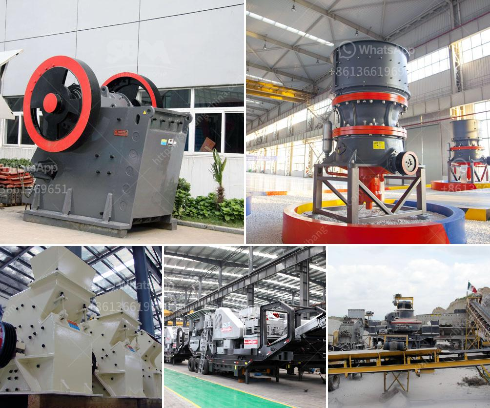

<h3>screening machine for phosphate mineral processing zmy</h3>
The use of phosphate minerals is essential in many industries, including agriculture, chemicals, and fertilizers. As demand for these minerals continues to grow, companies involved in phosphate mineral processing are constantly looking for ways to improve efficiency and production rates. One important tool in this process is the screening machine, which plays a crucial role in separating valuable phosphate minerals from unwanted materials.

One example of a screening machine commonly used in phosphate mineral processing is the ZMY series vibrating screen. This high-frequency vibrating screen is designed to efficiently separate materials based on their particle size and shape. Its unique design and advanced technology make it an ideal choice for various screening applications in the phosphate mineral industry.

One of the key features of the ZMY series vibrating screen is its high-frequency vibration, which allows for efficient separation of materials. This high-frequency vibration helps to break up the clumps and agglomerates often found in phosphate minerals, ensuring a more accurate screening process. The vibrating screen also has adjustable amplitude, allowing operators to control the separation efficiency based on specific requirements.

Another advantage of the ZMY series vibrating screen is its large capacity. With multiple layers of screens, this machine can handle a significant volume of feed material, resulting in higher production rates. Additionally, the screen's large screening area helps to reduce the time required for screening, increasing overall efficiency and throughput.

Furthermore, the ZMY series vibrating screen is designed for easy maintenance and operation. It features a simple structure with few moving parts, reducing the risk of downtime and costly repairs. The screen's mesh size can also be easily changed, allowing operators to adapt the machine to different processing needs and achieve desired separation results.

In terms of environmental impact, the ZMY series vibrating screen is designed with dust-proof sealing technology, minimizing the release of dust and pollutants into the surrounding air. This not only ensures a safer working environment but also complies with environmental regulations and standards.

Overall, the ZMY series vibrating screen is an essential screening machine in phosphate mineral processing. Its high-frequency vibration, large capacity, and easy maintenance make it a reliable and efficient tool for separating valuable phosphate minerals from unwanted materials. By incorporating this advanced technology into their operations, companies involved in phosphate mineral processing can enhance their productivity, improve product quality, and ultimately contribute to a more sustainable and efficient industry.
<h3>Contact us</h3><ul><li><strong>Whatsapp:&nbsp;<a href="https://wa.me/8613661969651">+8613661969651</a></strong></li><li><a href="https://swt.shibang-china.com/?git&amp;zhl&amp;screening machine for phosphate mineral processing zmy"><strong>Online Service(chat now)</strong></a></li></ul><h3>Related</h3><ul><li><a href='conveyor belts china.md'>conveyor belts china</a></li><li><a href='crushing construction waste crusher.md'>crushing construction waste crusher</a></li><li><a href='tracked crushers for sale south africa.md'>tracked crushers for sale south africa</a></li><li><a href='mobile stone crusher in south africa.md'>mobile stone crusher in south africa</a></li><li><a href='barytes pulverizer equipment.md'>barytes pulverizer equipment</a></li></ul>