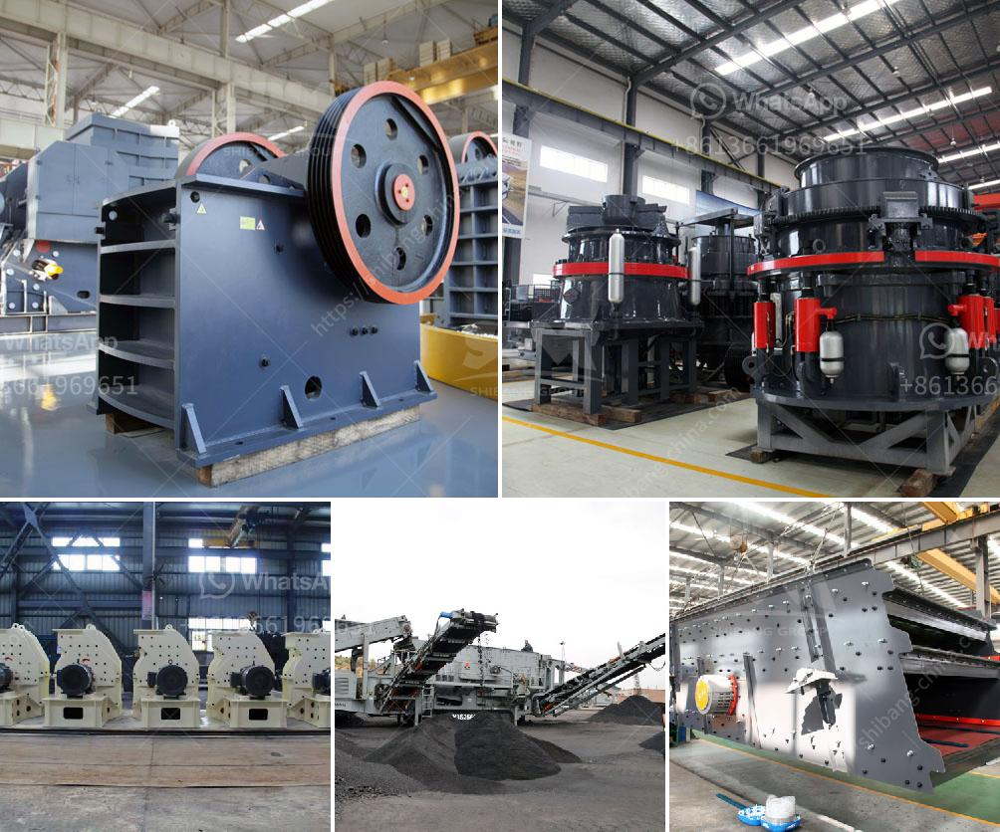

<h3>screw conveyor blade calculation</h3>
Screw conveyors are a widely used form of conveying equipment, which involves the use of a rotating helical screw blade to move bulk materials and products horizontally or at a slight incline. These systems are commonly found in industries such as agriculture, mining, food processing, construction, and many others. One of the crucial aspects of designing a screw conveyor is calculating the dimensions and characteristics of the screw conveyor blade.

The screw conveyor blade plays a vital role in the overall performance and efficiency of the conveyor system. It is responsible for moving, elevating, and discharging materials from one point to another. Therefore, accurate calculations and proper design of the blade are essential to ensure smooth operation and optimal productivity.

To calculate the screw conveyor blade, various factors need to be considered, including the type of material being conveyed, the desired capacity, the diameter of the screw, the pitch of the blade, and the rotational speed. Here are the steps involved in the calculation process:

1. Determine the material properties: The characteristics of the material being transported, such as its bulk density, particle size, and flowability, need to be known. These properties will affect the design of the screw, including the blade thickness, shape, and speed.

2. Determine the conveyor capacity: The required capacity of the conveyor system is determined by the volume of material to be conveyed within a given time period. This can be calculated by multiplying the bulk density of the material by the desired throughput.

3. Select the screw diameter: The diameter of the screw is determined based on the desired capacity, the angle of incline, and the size of the material. Larger diameter screws are capable of handling higher capacities and larger particles.

4. Calculate the pitch and flight thickness: The pitch refers to the distance between each flight on the screw blade. It is crucial to ensure that the pitch is appropriate to prevent material build-up or overflowing. The thickness of the blade affects the strength and durability of the screw.

5. Determine the rotational speed: The speed of the screw is essential in controlling the material flow rate and facilitating efficient conveying. It is typically expressed in revolutions per minute (RPM) and should be selected based on the characteristics of the material and the desired flow rate.

6. Consider additional factors: Depending on the specific application, other factors may need to be considered, such as the type of conveyor trough, the angle of incline, the type of bearings, and any special requirements for handling abrasive or corrosive materials.

In conclusion, calculating the screw conveyor blade is a crucial step in designing an efficient conveying system. By considering factors such as material properties, desired capacity, screw diameter, pitch, rotational speed, and other application-specific requirements, engineers can ensure the proper functioning and productivity of the screw conveyor. Accurate calculations and careful design can result in a reliable and cost-effective conveying solution for a wide range of industries.
<h3>Contact us</h3><ul><li><strong>Whatsapp:&nbsp;<a href="https://wa.me/8613661969651">+8613661969651</a></strong></li><li><a href="https://swt.shibang-china.com/?git&amp;zhl&amp;screw conveyor blade calculation"><strong>Online Service(chat now)</strong></a></li></ul><h3>Related</h3><ul><li><a href='belt conveyor belt suppliers in oman.md'>belt conveyor belt suppliers in oman</a></li><li><a href='chrome mining process machines.md'>chrome mining process machines</a></li><li><a href='gold wash plant trommel for sale in dubai.md'>gold wash plant trommel for sale in dubai</a></li><li><a href='philippine limestone crusher for calcium carbonate.md'>philippine limestone crusher for calcium carbonate</a></li><li><a href='rock stone crushing machine in usa.md'>rock stone crushing machine in usa</a></li></ul>