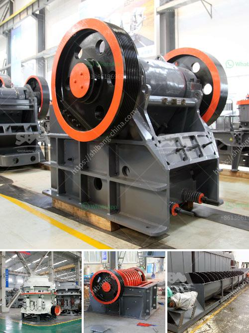

<h3>screw feeder capacity 5 ton hour</h3>
A screw feeder is an essential industrial equipment used for conveying materials from one process to another. Its capacity plays a crucial role in determining the efficiency of the entire production line. In this article, we will discuss a screw feeder with a capacity of 5 tons per hour.

A screw feeder with a 5-ton per hour capacity is designed to handle a significant amount of material within a specified time frame. Whether it is handling bulk materials like grains, aggregates, or powders, this capacity ensures a smooth and continuous flow of materials in the production process.

One of the key advantages of a screw feeder with a high capacity is its ability to improve productivity and reduce downtime. With a 5-ton capacity per hour, larger quantities of material can be transported efficiently, minimizing the need for manual intervention and optimizing the entire production line.

The screw feeder's design also plays a vital role in maintaining the desired capacity. The size and length of the screw, along with the pitch, are critical factors that ensure optimal material flow. Careful consideration should be given to these design aspects to prevent clogging or material backup that could impact the feeder's capacity.

Additionally, the power and drive system of the screw feeder should be reliable and robust enough to handle the load and ensure consistent performance. High-quality components and regular maintenance are essential to guarantee smooth operation and prevent any unexpected breakdowns.

Controlling the speed of the screw feeder is crucial to maintaining the desired capacity. Proper monitoring and adjustment of the speed can ensure that the 5-ton per hour capacity is consistently achieved. Implementing an intelligent control system can also help in optimizing the flow rate based on real-time requirements.

In conclusion, a screw feeder with a capacity of 5 tons per hour is a valuable asset in various industries. Its ability to handle large quantities of material efficiently can significantly enhance productivity and minimize downtime. However, proper design, reliable power system, and accurate speed control are essential to maximize its capacity and ensure a smooth and uninterrupted production process.
<h3>Contact us</h3><ul><li><strong>Whatsapp:&nbsp;<a href="https://wa.me/8613661969651">+8613661969651</a></strong></li><li><a href="https://swt.shibang-china.com/?git&amp;zhl&amp;screw feeder capacity 5 ton hour"><strong>Online Service(chat now)</strong></a></li></ul><h3>Related</h3><ul><li><a href='fuel consumption of stone crushers.md'>fuel consumption of stone crushers</a></li><li><a href='jual mesin hammer mill crusher for sale.md'>jual mesin hammer mill crusher for sale</a></li><li><a href='to buy mobile crushing plant price.md'>to buy mobile crushing plant price</a></li><li><a href='hydraulic cone crushers.md'>hydraulic cone crushers</a></li><li><a href='denver ball mills.md'>denver ball mills</a></li></ul>