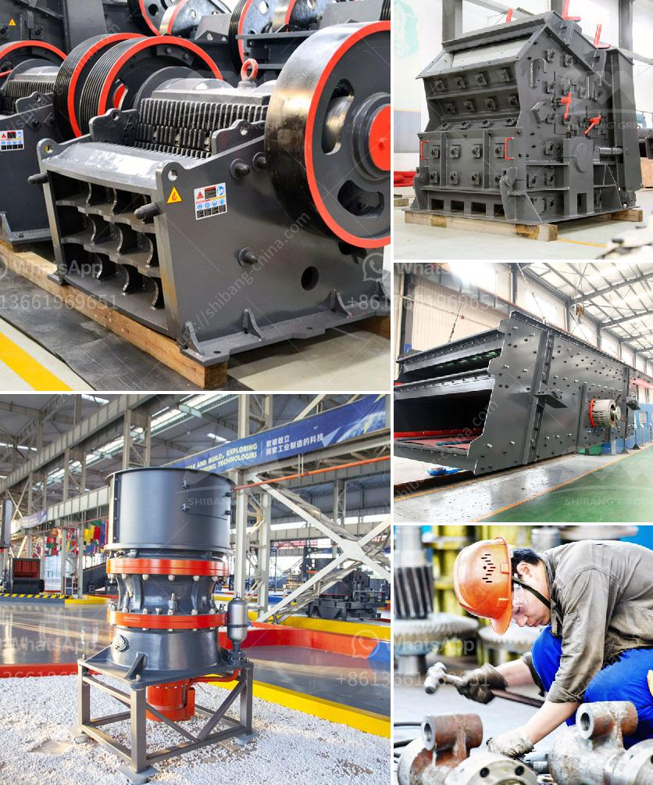

<h3>second hand ball mill europe</h3>
Second hand ball mills have been in use for decades, and are popular among industries for their versatility and cost-effectiveness. In Europe, these machines are widely sought after as they offer an efficient and reliable way of grinding materials into fine powders.

A ball mill is a type of cylindrical grinder used for grinding material into different sizes or mixing bulk materials together. It works on the principle of impact and attrition: the balls inside the mill grind the material as it rotates, while the forces of centrifugal motion cause the balls to rise and fall onto the material, crushing and grinding it into a desired product.

The market for second hand ball mills in Europe is thriving due to the vast number of industries that require grinding materials in various forms. These machines are commonly used in mining, chemical, ceramic, and construction industries, among others. By purchasing a second hand ball mill, businesses can save significant costs compared to buying new equipment. This is especially beneficial for small to medium-sized enterprises looking to expand their operations.

In addition to cost savings, opting for a second hand ball mill can also help reduce environmental impact. By recycling and reusing old machines, resources are conserved, leading to a more sustainable approach to manufacturing. Furthermore, many second hand ball mills available in Europe undergo refurbishment and upgrading, ensuring that they meet modern standards of efficiency and safety.

When purchasing a second hand ball mill, it is essential to consider several factors such as the capacity, condition, and overall maintenance history of the machine. It is recommended to consult with an experienced dealer or seller who can provide detailed information and offer guidance on selecting the most suitable ball mill for specific requirements.

In conclusion, second hand ball mills are a popular choice among industries in Europe due to their cost-effectiveness, versatility, and eco-friendly nature. These machines offer an efficient grinding solution for various materials and can significantly contribute to reducing production costs and environmental impact. It is crucial to carefully evaluate and select a reliable supplier when considering the purchase of a second hand ball mill.
<h3>Contact us</h3><ul><li><strong>Whatsapp:&nbsp;<a href="https://wa.me/8613661969651">+8613661969651</a></strong></li><li><a href="https://swt.shibang-china.com/?git&amp;zhl&amp;second hand ball mill europe"><strong>Online Service(chat now)</strong></a></li></ul><h3>Related</h3><ul><li><a href='iron ore smelter equipment.md'>iron ore smelter equipment</a></li><li><a href='small cement grinding machine.md'>small cement grinding machine</a></li><li><a href='vertical ultra fine pulverizer.md'>vertical ultra fine pulverizer</a></li><li><a href='stone benta stone crusher in parral chihuahua.md'>stone benta stone crusher in parral chihuahua</a></li><li><a href='how much does gold mining licences in nigeria.md'>how much does gold mining licences in nigeria</a></li></ul>