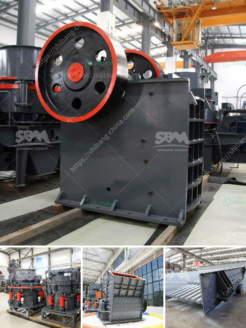

<h3>second hand cement mill in india</h3>
A cement mill is the equipment used to grind the hard, nodular clinker from the cement kiln into the fine grey powder that is cement. Most cement is currently ground in ball mills and also vertical roller mills which are more effective than ball mills.

Cement played a pivotal role in the modernization and industrialization of India. With several government initiatives to promote infrastructural development and boost the economy, the demand for cement is constantly growing. To meet this demand, cement companies often invest in new cement mills.

However, buying a brand new cement mill can be a expensive undertaking, especially for individuals or small-scale enterprises. Fortunately, there is a solution, and that is purchasing a second-hand cement mill from a trusted source like a seller who specializes in used cement mills.

Second-hand equipment not only saves money but also helps in reducing waste. In the era of sustainability, opting for a pre-owned mill becomes a more conscious choice. It is a form of recycling, preventing unnecessary consumption of resources and minimizing the carbon footprint.

When buying a second-hand cement mill, it is essential to consider various factors to ensure the quality and reliability of the equipment. Firstly, one must carefully evaluate the condition of the mill, checking for any damages or defects. It is advisable to inspect the mill personally or hire an expert to do an assessment. 

In addition to the physical condition, it is crucial to inquire about the maintenance and service history of the mill. Obtaining this information helps in understanding how well the mill has been taken care of and if any major repairs or replacements have been done. It is also beneficial to check if the mill comes with any warranty or guarantee.

Another significant aspect is to verify the reputation and credibility of the seller. Dealing with a trusted and reputable seller ensures a smooth buying process and reduces the chance of any fraudulent transactions.

Opting for a second-hand cement mill does not mean compromising on quality or efficiency. One can find well-maintained mills that are in excellent working condition. It is important to carefully review the specifications and technical details of the mill, such as its production capacity, motor power, and compatibility with other equipment in the cement production process.

India is a vast country with numerous cement mills spread across various regions. This provides buyers with several options when it comes to purchasing a second-hand cement mill. Additionally, online platforms have made it easier to connect buyers and sellers, expanding the market and facilitating transactions.

In conclusion, investing in a second-hand cement mill in India can be a cost-effective and environmentally responsible choice. It allows businesses and individuals to acquire the necessary equipment without experiencing a significant financial burden. With appropriate research and due diligence, buyers can find reliable and efficient cement mills that meet their requirements and contribute to their success in the cement industry.
<h3>Contact us</h3><ul><li><strong>Whatsapp:&nbsp;<a href="https://wa.me/8613661969651">+8613661969651</a></strong></li><li><a href="https://swt.shibang-china.com/?git&amp;zhl&amp;second hand cement mill in india"><strong>Online Service(chat now)</strong></a></li></ul><h3>Related</h3><ul><li><a href='lsx sand washing machine.md'>lsx sand washing machine</a></li><li><a href='jual mesin hammer mill crusher for sale.md'>jual mesin hammer mill crusher for sale</a></li><li><a href='rock stone crushing machine in usa.md'>rock stone crushing machine in usa</a></li><li><a href='high pressure grinding mill.md'>high pressure grinding mill</a></li><li><a href='static jaw crusher for sale in south africa.md'>static jaw crusher for sale in south africa</a></li></ul>