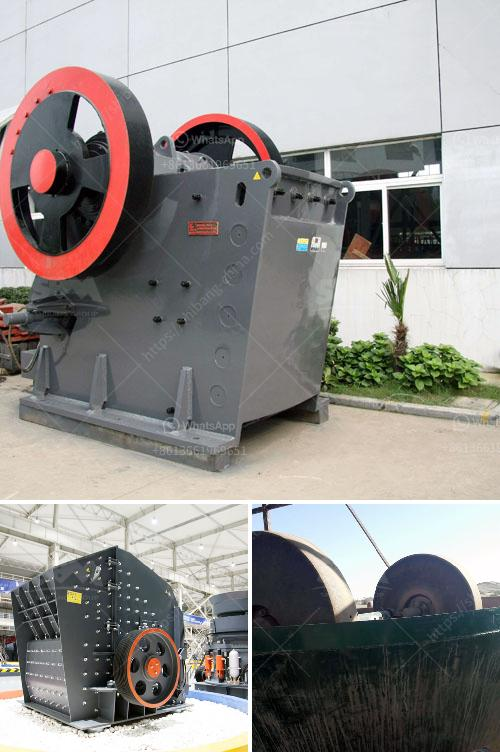

<h3>second hand crushers price in india</h3>
It is estimated that there are over 12,000 stone crusher machines in India. In mining industry, the demands of crushing machines are increasing as well. Different types of crushers have different production capacities. The generally used crushers are jaw crusher, impact crusher, cone crusher and hammer crusher. According to the raw materials’ different particles and hardness, there are several suitable crushers which can be used in the crushing.

Second-hand crushers are in great demand in India as more and more manufacturers have produced these crushers to compete with the international crusher manufacturers. Those companies only focused on improving their production technology and ignored the quality of spare parts. Nowadays, there are more and more used crushers in the Indian market, which reduces the overall market price of the crushers and reflects the specific price advantage of the second-hand products.

Due to the advanced production technology of stone crusher machines and the constantly updated research and development methods, the market competition in the Indian mining industry has been fierce for decades. The used crusher can crush various materials with medium hardness, and it is widely used in mining, smelting, building materials, transportation, water conservancy, chemical and other industries.

In India, there are many suppliers and manufacturers of stone crusher machines. Some of them are famous and trustworthy. In choosing a suitable crusher machine, you need to consider the following factors:

1. The crusher machine’s price should be checked before purchase. You should compare several suppliers and choose a company with the most reasonable price, which will save you a lot of money.

2. The quality of the crusher machine is the most important factor affecting its price. Different crushers have different quality standards, so you need to make a detailed understanding of the machine's quality before buying it.

3. After-sales service is also one of the important factors affecting the price. A good after-sales service can solve various problems encountered during the use of the crusher, so it is necessary to consider the company's after-sales service ability.

4. In addition, the specific requirements of the crusher machine should also be considered. Different types of crushers have different requirements for materials, feeding size, output size, etc. Therefore, it is necessary to clarify your own requirements before purchasing.

In summary, the price of second-hand crushers is closely related to the model, size, and manufacturer. The quality and after-sales service of the machine also affect its price. As a buyer, it's important to choose a trustworthy and reliable supplier to ensure the overall quality and performance of the crusher. The availability of second-hand crushers at a lower price provides a cost-effective option for those who are looking to invest in the Indian mining industry.
<h3>Contact us</h3><ul><li><strong>Whatsapp:&nbsp;<a href="https://wa.me/8613661969651">+8613661969651</a></strong></li><li><a href="https://swt.shibang-china.com/?git&amp;zhl&amp;second hand crushers price in india"><strong>Online Service(chat now)</strong></a></li></ul><h3>Related</h3><ul><li><a href='dolomite powder grinding mill in india.md'>dolomite powder grinding mill in india</a></li><li><a href='crushing machine manufacturers cape town.md'>crushing machine manufacturers cape town</a></li><li><a href='crushing equipment aggregates crushing.md'>crushing equipment aggregates crushing</a></li><li><a href='roller mill price.md'>roller mill price</a></li><li><a href='stone crushers machinery in south africa.md'>stone crushers machinery in south africa</a></li></ul>