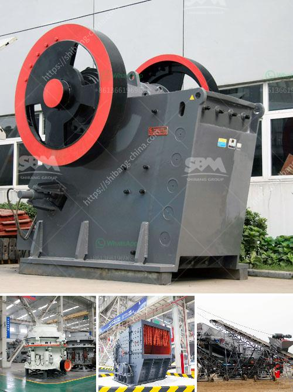

<h3>second hand diamond dms plant for sale kimberly</h3>
The diamond industry has long held a certain mystique, with precious stones symbolizing beauty, rarity, and luxury. Jewelers, miners, and investors alike are often on the lookout for innovative solutions to extract these precious gems efficiently, and one such solution is a Diamond DMS Plant. In the picturesque South African town of Kimberly, the cradle of the diamond industry, a second-hand Diamond DMS Plant is up for sale, promising to unlock new possibilities for diamond processing.

Diamond Dense Media Separation (DMS) Plants are instrumental in the diamond extraction process, ensuring the efficient recovery of diamonds from their ore matrix. Utilizing the principles of gravity separation, DMS plants separate diamonds from other material based on their density, enabling higher recovery rates. This technology is widely utilized in the diamond industry to maximize diamond yields and enhance operational efficiency.

The town of Kimberly, located in the Northern Cape Province of South Africa, holds immense significance in the history of diamond mining. The diamond fields discovered by the De Beers brothers in 1869 led to the establishment of Kimberly as the world-renowned "Diamond City." Today, Kimberly retains its status as a premier diamond mining location, attracting miners, investors, and industry professionals from around the globe.

A rare opportunity presents itself in Kimberly, as a second-hand Diamond DMS Plant has become available for purchase. The plant offers diamond processors the chance to acquire cutting-edge technology at a fraction of the cost of a new plant. Investing in this second-hand DMS Plant can provide companies with a competitive edge, allowing them to process larger volumes of ore and increase diamond recovery rates, ultimately maximizing profits.

Acquiring a second-hand Diamond DMS Plant offers significant cost advantages over purchasing a brand new plant. The reduced price enables operators to allocate more resources toward other essential aspects of their operations, such as exploration or marketing. Additionally, a second-hand plant provides an opportunity for customization and upgrade options, integrating enhancements to improve efficiency and diamond recovery rates without breaking the bank.

The availability of a second-hand Diamond DMS Plant for sale in the diamond mining epicenter of Kimberly heralds a new era of opportunity for diamond processors. This technologically advanced plant offers lower initial investment costs, improved operational efficiency, and the potential for customization to suit specific processing requirements. As industry professionals seek innovative solutions to maximize diamond recovery, acquiring this second-hand plant represents a strategic investment that can unlock strong returns and establish a competitive advantage in the dynamic diamond market.
<h3>Contact us</h3><ul><li><strong>Whatsapp:&nbsp;<a href="https://wa.me/8613661969651">+8613661969651</a></strong></li><li><a href="https://swt.shibang-china.com/?git&amp;zhl&amp;second hand diamond dms plant for sale kimberly"><strong>Online Service(chat now)</strong></a></li></ul><h3>Related</h3><ul><li><a href='mobile crusher sales in nairobi.md'>mobile crusher sales in nairobi</a></li><li><a href='sand making plant china.md'>sand making plant china</a></li><li><a href='stone crusher in stone.md'>stone crusher in stone</a></li><li><a href='raymond mill for sale second hand.md'>raymond mill for sale second hand</a></li><li><a href='granite feeding equipment manufacturer.md'>granite feeding equipment manufacturer</a></li></ul>