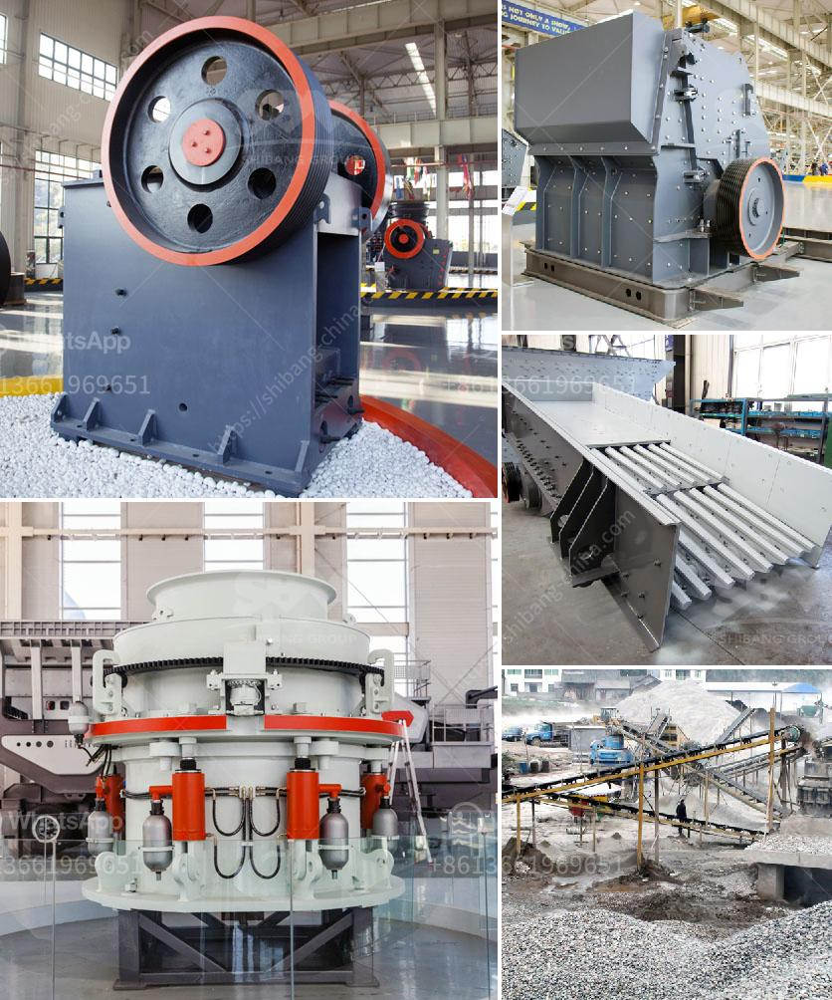

<h3>second hand jaw crusher for sale in harare</h3>
Jaw crushers are often used as primary crushers and are perhaps the most popular crusher worldwide. These compressive crushers are suitable for most any type of material. In this type of crusher, reduction takes place between a stationary jaw plate and a moving jaw plate. The moving jaw plate is mounted on the pitman, which is given a reciprocating motion. Crushing takes place when the pitman moves toward the stationary jaw, compressing the material.

If you are in need of a jaw crusher, you are in luck. A second hand jaw crusher for sale in Harare is an option that you should consider. This crusher is the perfect solution for crushing even the toughest rock materials. It comes with a high production capacity, yet is compact and easy to transport. The crushing chamber is adjustable, allowing you to obtain the desired size of the final product.

One of the advantages of a jaw crusher is its simplicity. This crusher does not require complex maintenance or repair procedures, making it a cost-effective option. Additionally, the jaw crusher is known for its reliability and endurance. It is able to withstand heavy-duty applications and continuous operation, making it a reliable choice for various industries.

Purchasing a second hand jaw crusher for sale in Harare is an attractive option for several reasons. Firstly, you can save a significant amount of money by purchasing a used jaw crusher. This can be especially beneficial if you are on a tight budget or simply do not want to spend too much on a machine that you will not use frequently.

Secondly, buying a second hand jaw crusher allows you to get a high-quality machine without having to wait for the manufacturing process. Since the crusher is already built, you can immediately put it to use for your crushing needs. This can be particularly advantageous if you need a jaw crusher urgently or if you are in a remote location where new machines may take longer to arrive.

When considering a second hand jaw crusher for sale in Harare, it is important to perform a thorough inspection of the machine. Check for any signs of wear or damage and ensure that all components are in good working order. You may also want to request a test run to ensure that the crusher operates smoothly and efficiently.

Additionally, make sure to inquire about the crusher's history and maintenance records. This will give you insight into how the machine was used and whether it was properly maintained. It is also helpful to ask for any available documentation, such as user manuals or service records.

In conclusion, if you are in need of a jaw crusher, a second hand option for sale in Harare can be a great choice. It provides you with a cost-effective solution that is reliable, durable, and easy to use. By purchasing a used jaw crusher, you can save money and immediately put the machine to work for your crushing needs. Just make sure to carefully inspect the machine and inquire about its history and maintenance records before making a purchase decision.
<h3>Contact us</h3><ul><li><strong>Whatsapp:&nbsp;<a href="https://wa.me/8613661969651">+8613661969651</a></strong></li><li><a href="https://swt.shibang-china.com/?git&amp;zhl&amp;second hand jaw crusher for sale in harare"><strong>Online Service(chat now)</strong></a></li></ul><h3>Related</h3><ul><li><a href='iron ore crusher units in orissa.md'>iron ore crusher units in orissa</a></li><li><a href='copper crusher price.md'>copper crusher price</a></li><li><a href='screw feeder capacity 5 ton hour.md'>screw feeder capacity 5 ton hour</a></li><li><a href='manganese ore sintering process.md'>manganese ore sintering process</a></li><li><a href='ball mill instrument equipment.md'>ball mill instrument equipment</a></li></ul>