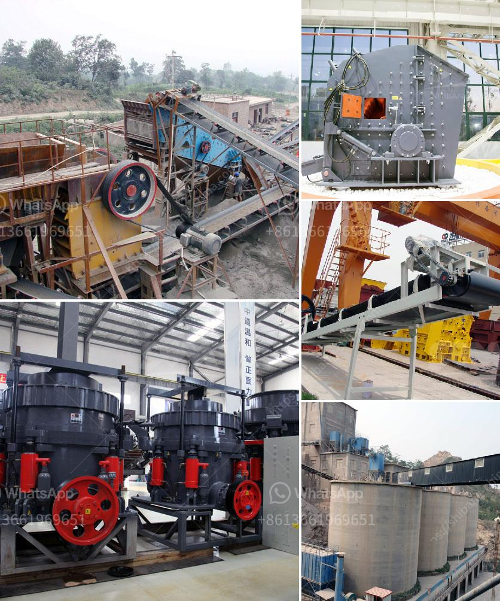

<h3>second hand stone crusher equipment medium size</h3>
Second hand stone crusher machines are extensively used in various domains such as mining, infrastructure, building, highways, and railways for crushing different materials. The growing need for high-quality second hand stone crusher machines also drives the demand for its market. However, the competitive landscape of the market makes it difficult for small businesses to compete with larger companies, which is why second hand stone crusher equipment medium size is widely used.

Medium size stone crusher machines are widely used in the mining and smelting industry. Typically, medium size stone crusher machines are designed by a number of engineers from various countries. Small and medium size stone crusher machines are responsible for crushing various stones, stones, volcanic rocks, limestone, granite, iron ore, coal, concrete materials, etc.

Due to their large feed opening, high reduction rate, and high processing capacity, medium size stone crusher machines are favored by mining companies. In addition, the medium size stone crusher machines have the advantages of easy transportation, low maintenance, and high mobility.

The second hand stone crusher equipment medium size can be compacted and transported easily, and the installation is simple and efficient. Depending on the size and hardness of the material to be crushed, the ideal feed size can be selected to ensure the best performance of the crusher.

The second hand stone crusher equipment medium size is widely used in mining, metallurgy, construction, building materials, chemical, electric power, transportation, and other industries. It has the advantages of large crushing ratio, high crushing efficiency, low energy consumption, uniform product size, and good particle shape. Furthermore, it has a wide range of applications, can crush various materials with compressive strength not exceeding 320 MPa.

The second hand stone crusher equipment medium size has a wide range of uses and can be tailored to suit different production needs. It is suitable for large-scale industrial production and is widely used in metallurgical, chemical, building materials, mining and other industries.

The second hand stone crusher equipment medium size generally includes jaw crushers, impact crushers, cone crushers, hammer crushers, sand making machines, vibrating screens, sand washing machines, conveyors, etc. The use of specific equipment to carry out coarse and medium crushing operations can greatly improve the efficiency of the stone crushing process.

In summary, the second hand stone crusher equipment medium size market is constantly expanding due to the increasing demand for the mining and processing of stones and minerals. The production capacity and product quality of the medium size stone crusher machines are closely related to the economic benefits of mining companies. Therefore, it is necessary to select the appropriate equipment according to the characteristics of the stone and the specifications of the finished product to ensure the efficient and stable operation of the crushing system.
<h3>Contact us</h3><ul><li><strong>Whatsapp:&nbsp;<a href="https://wa.me/8613661969651">+8613661969651</a></strong></li><li><a href="https://swt.shibang-china.com/?git&amp;zhl&amp;second hand stone crusher equipment medium size"><strong>Online Service(chat now)</strong></a></li></ul><h3>Related</h3><ul><li><a href='equipment for gold mining belgium.md'>equipment for gold mining belgium</a></li><li><a href='program to simulate conveyor belts.md'>program to simulate conveyor belts</a></li><li><a href='hydraulic concrete crusher rent mn.md'>hydraulic concrete crusher rent mn</a></li><li><a href='south africa manufacturer of mobile gold processing plant.md'>south africa manufacturer of mobile gold processing plant</a></li><li><a href='list of the price of crushing plant turkey.md'>list of the price of crushing plant turkey</a></li></ul>