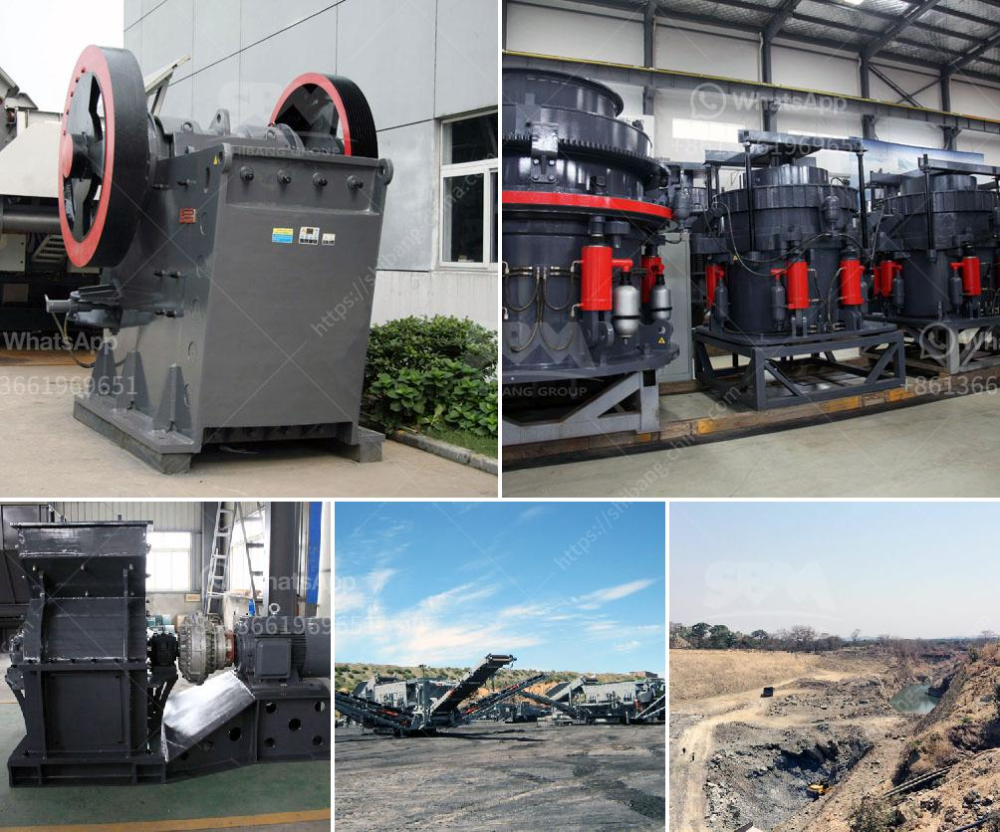

<h3>secondary zinc production equipment</h3>
Secondary zinc production refers to the recycling of zinc-containing materials such as zinc scrap, zinc dross, and zinc oxide. Recycling these materials not only helps conserve natural resources but also reduces the energy consumption and emissions associated with primary zinc production. In order to efficiently carry out secondary zinc production, various equipment is utilized.

One of the key pieces of equipment in secondary zinc production is the rotary furnace. This furnace is designed to melt zinc-containing materials at high temperatures, typically above 1000°C, in order to separate the zinc from impurities. The furnace is equipped with a cylindrical drum that rotates, allowing for better mixing and heat transfer. This ensures thorough melting of the materials and promotes the separation of zinc from other metals and debris.

Another crucial equipment in secondary zinc production is the baghouse filter system. As the materials are heated, gases and fumes are released, including zinc oxide fumes. These fumes can be harmful to the environment and human health, so it is important to capture and treat them. The baghouse filter system uses a series of fabric filters to trap the particles and fumes. The filtered air is then released back into the atmosphere, while the captured zinc particles are collected for further processing.

A centrifugal separator is also used in secondary zinc production to separate the molten zinc from slag. Slag is the residue remaining after the impurities in the zinc-containing materials have been removed. The separator uses centrifugal force to separate the heavier zinc from the lighter slag. This process ensures that the recovered zinc is of high purity and can be used for various applications, including the production of galvanized steel.

To further refine the secondary zinc, equipment such as distillation columns and electrolytic cells are used. Distillation columns remove impurities such as lead, cadmium, and iron from the molten zinc, resulting in a higher purity product. Electrolytic cells, on the other hand, are used to produce high-grade zinc through the electroplating process. These processes are essential for ensuring the quality and usability of the secondary zinc produced.

In conclusion, secondary zinc production plays a vital role in sustainable resource management. The equipment used in this process, including rotary furnaces, baghouse filter systems, centrifugal separators, distillation columns, and electrolytic cells, ensures the efficient recycling and refining of zinc-containing materials. By implementing these technologies, the secondary zinc production industry not only reduces environmental impact but also contributes to the circular economy by transforming waste materials into valuable resources.
<h3>Contact us</h3><ul><li><strong>Whatsapp:&nbsp;<a href="https://wa.me/8613661969651">+8613661969651</a></strong></li><li><a href="https://swt.shibang-china.com/?git&amp;zhl&amp;secondary zinc production equipment"><strong>Online Service(chat now)</strong></a></li></ul><h3>Related</h3><ul><li><a href='grinding ball for ball mills.md'>grinding ball for ball mills</a></li><li><a href='cement process plant crushing machines manufacturer.md'>cement process plant crushing machines manufacturer</a></li><li><a href='crusher type 600 tph.md'>crusher type 600 tph</a></li><li><a href='belt price conveyor belt price malaysia.md'>belt price conveyor belt price malaysia</a></li><li><a href='200tph old cone crusher plant india hyderabad.md'>200tph old cone crusher plant india hyderabad</a></li></ul>