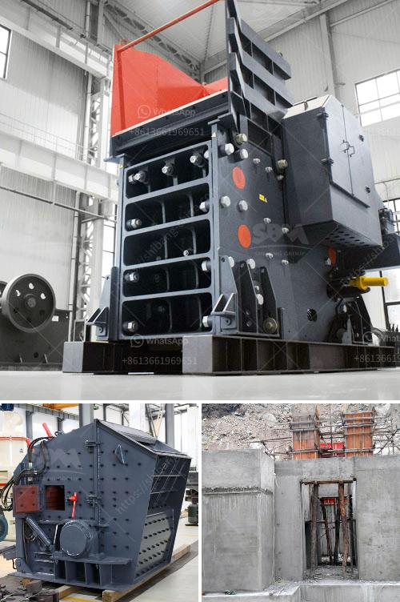

<h3>sell 150 tph stone crusher</h3>
Selling a 150 tph stone crusher machine has become a hot topic for mining enterprises these days. This type of crusher machine has many advantages compared with traditional crusher machines, such as large crushing ratio, low energy consumption, high efficiency and so on. Users can choose the appropriate type of stone crusher machine to finish the processing of stones with different hardness.

The 150 tph stone crusher machine is equipped with jaw crusher and impact crusher for big abridgment ratio. Typically jaw crusher is used in primary crushing, and impact crusher is used in secondary crushing. The impact crusher is a new type of high efficient stone crusher machine, which is characterized by small volume, simple structure, large crushing ratio, low energy consumption, large production capacity, uniform product size, and selective crushing. It’s a promising piece of equipment.

1. The impact crusher is widely used in railway, highway, energy, cement, chemical, construction and other industries.

3. The crushed materials are in good particle shape, and the crushed materials are cube-shaped with high bulk density.

4. During the crushing process, the stone materials will form a protective layer, which can effectively prevent dust and reduce pollution.

6. The bearing seat is separate, and the rotor is fixed by a locate round bolt, which has advantages of convenient installation and maintenance.

When selling this type of stone crusher machine, it is important to ensure that the prospective buyers are informed about the features and benefits of the machine in order to generate interest. Among the target market, there are many industries that can benefit from the 150 tph stone crusher machine, including mining, construction, asphalt manufacturing, cement production, and railway engineering, among others.

To attract more customers, it is essential to provide detailed information about the machine, such as its technical specifications, capacity, energy consumption, and the materials it can process. Additionally, it is also important to highlight any unique selling points, such as special features or innovative design elements that set this stone crusher machine apart from others in the market.

In summary, selling a 150 tph stone crusher machine can be a profitable venture for mining businesses. It is a good investment choice because it can not only provide high productivity but also guarantee the quality of the final product. With many unique features and advantages, the potential market for this machine is significant. By effectively marketing the machine and providing all the necessary information, it is possible to attract potential buyers and maximize sales.
<h3>Contact us</h3><ul><li><strong>Whatsapp:&nbsp;<a href="https://wa.me/8613661969651">+8613661969651</a></strong></li><li><a href="https://swt.shibang-china.com/?git&amp;zhl&amp;sell 150 tph stone crusher"><strong>Online Service(chat now)</strong></a></li></ul><h3>Related</h3><ul><li><a href='sample business plan for stone crusher.md'>sample business plan for stone crusher</a></li><li><a href='used small gold processing plant from dubai.md'>used small gold processing plant from dubai</a></li><li><a href='crusher prices stone crusher.md'>crusher prices stone crusher</a></li><li><a href='gypsum mill production.md'>gypsum mill production</a></li><li><a href='ball mill grinding micronizer.md'>ball mill grinding micronizer</a></li></ul>