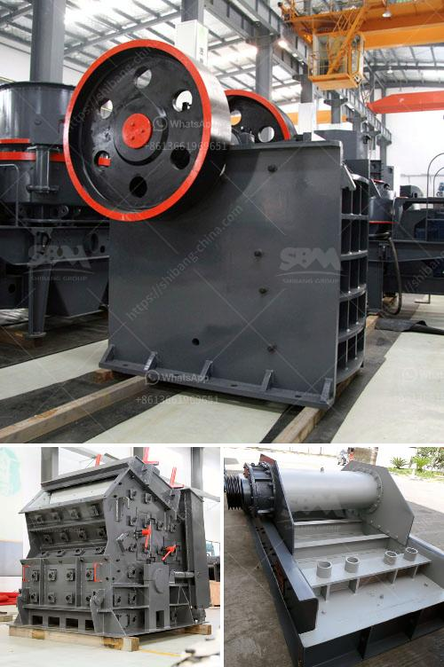

<h3>selling conveyor belts in kenya</h3>
Conveyor belts have become an integral part of various industries in Kenya, revolutionizing the way goods are transported within factories and warehouses. These belts are designed to move materials effortlessly, saving time and improving efficiency. As the demand for conveyor belts continues to rise, businesses in Kenya are capitalizing on this opportunity by offering a wide range of conveyor belts to meet different industrial needs.

The success of conveyor belts lies in their ability to transport goods smoothly and efficiently. They are commonly used in industries such as mining, construction, agriculture, and manufacturing, among others. The belts are made from durable materials like rubber, PVC, or fabric, and are equipped with robust mechanisms that allow for continuous movement of items.

One particular industry in Kenya that greatly benefits from conveyor belts is mining. These belts are used to transport large quantities of minerals from mines to processing plants, reducing labor costs and increasing productivity. Similarly, the construction industry relies on conveyor belts to move heavy building materials, such as sand, gravel, and concrete, on construction sites. These belts help streamline the construction process and improve overall efficiency.

With the increasing demand for conveyor belts in Kenya, several companies have emerged to cater to this growing market. These businesses offer a wide range of conveyor belts with varying specifications to meet the diverse needs of different industries. They provide belts of various lengths, widths, and load-bearing capacities, ensuring that their customers can find the perfect belt for their specific requirements.

In addition to selling conveyor belts, these companies also offer installation and maintenance services. They understand that conveyor belts require regular maintenance to ensure optimal performance and longevity. Therefore, they provide technical support and routine maintenance checks to keep the belts running smoothly and minimize downtime.

The availability of conveyor belts in Kenya has transformed the way industries operate in the country. They have made manufacturing processes more efficient, reduced labor costs, and enabled businesses to meet increasing demands. As Kenya's industrial sector continues to grow, the demand for conveyor belts will only increase further, making it an attractive business opportunity for entrepreneurs.

In conclusion, the selling of conveyor belts in Kenya has opened up new possibilities for various industries. These belts have proven to be essential for streamlining operations and increasing productivity. With the growing demand, businesses offering conveyor belts in Kenya are well-positioned to capitalize on this lucrative market. As the industrial sector continues to flourish, the need for conveyor belts will remain constant, making it a promising industry in Kenya's business landscape.
<h3>Contact us</h3><ul><li><strong>Whatsapp:&nbsp;<a href="https://wa.me/8613661969651">+8613661969651</a></strong></li><li><a href="https://swt.shibang-china.com/?git&amp;zhl&amp;selling conveyor belts in kenya"><strong>Online Service(chat now)</strong></a></li></ul><h3>Related</h3><ul><li><a href='stone crusher hospital dhaka.md'>stone crusher hospital dhaka</a></li><li><a href='industrial fine powder grinding machinery.md'>industrial fine powder grinding machinery</a></li><li><a href='stone crusher plant 100tph layout.md'>stone crusher plant 100tph layout</a></li><li><a href='belt conveyor supplier in china.md'>belt conveyor supplier in china</a></li><li><a href='manufacturing of conveyor belts in the vaal region.md'>manufacturing of conveyor belts in the vaal region</a></li></ul>