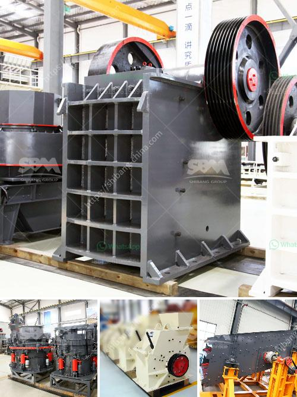

<h3>sells vibrating screens for gravel sand</h3>
In the world of construction and mining, the extraction and processing of gravel sand play a crucial role. During these processes, the use of vibrating screens is fundamental in order to sort and classify materials of different sizes efficiently. These dynamic machines help improve productivity and enhance the quality of gravel sand through effective separation and segregation.

Vibrating screens designed for gravel sand are versatile machinery suitable for various operations; they come in different sizes and configurations to cater to specific requirements. These screens are commonly utilized in aggregate processing plants, mining operations, recycling centers, and other industries dealing with granular materials.

The primary function of vibrating screens for gravel sand is to separate and segregate the desired aggregate particles according to their size. These screens consist of a vibrating motor or exciter that produces vibrations, causing the materials to move in specific patterns on the screen surface. As a result, the larger-sized materials are retained on the screen while the smaller-sized particles pass through.

The vibrating motion of the screens not only helps in efficient separation, but it also prevents blockages and promotes constant material flow. This eliminates the risk of material buildup and enhances productivity during the production process.

To provide tailored solutions for different applications, vibrating screen manufacturers offer a wide range of designs and configurations. These include single-deck and multi-deck screens, with various screen media options such as woven wire mesh, perforated plate, or polyurethane modular panels. The customization options allow operators to achieve precise separation, taking into account different material characteristics and production goals.

Moreover, vibrating screens can be equipped with additional features such as water sprays, dust enclosures, and noise reduction components. These add-ons contribute to a safer and cleaner working environment, ensuring compliance with environmental regulations and maintaining the wellbeing of workers.

1. Enhanced Separation: The ability to separate different sizes of gravel sand particles efficiently improves the quality and consistency of the final product.

2. Increased Productivity: By utilizing vibrating screens, production plants can achieve higher throughput rates due to faster material screening and reduced downtime caused by blockages.

3. Cost Reduction: Vibrating screens help optimize the use of raw materials by eliminating oversized or undersized particles. This leads to less waste, reduced energy consumption, and increased profitability.

4. Versatility: With customizable designs and configurations, vibrating screens cater to a wide range of applications, making them suitable for various industries and aggregate materials.

Vibrating screens for gravel sand are indispensable tools in the construction and mining industries, revolutionizing the way materials are processed. Their ability to efficiently separate and classify granular materials according to size, along with their customization possibilities, provide countless benefits to operators, including increased productivity and improved product quality. In a competitive market, investing in high-quality vibrating screens is an essential step towards achieving optimal performance, cost-efficiency, and customer satisfaction.
<h3>Contact us</h3><ul><li><strong>Whatsapp:&nbsp;<a href="https://wa.me/8613661969651">+8613661969651</a></strong></li><li><a href="https://swt.shibang-china.com/?git&amp;zhl&amp;sells vibrating screens for gravel sand"><strong>Online Service(chat now)</strong></a></li></ul><h3>Related</h3><ul><li><a href='static jaw crusher for sale in south africa.md'>static jaw crusher for sale in south africa</a></li><li><a href='gravel manufacturing company in thiruvallur district.md'>gravel manufacturing company in thiruvallur district</a></li><li><a href='manganese crusher processing plant in india.md'>manganese crusher processing plant in india</a></li><li><a href='the weight of stone crusher.md'>the weight of stone crusher</a></li><li><a href='feldspar stone crushing plant.md'>feldspar stone crushing plant</a></li></ul>