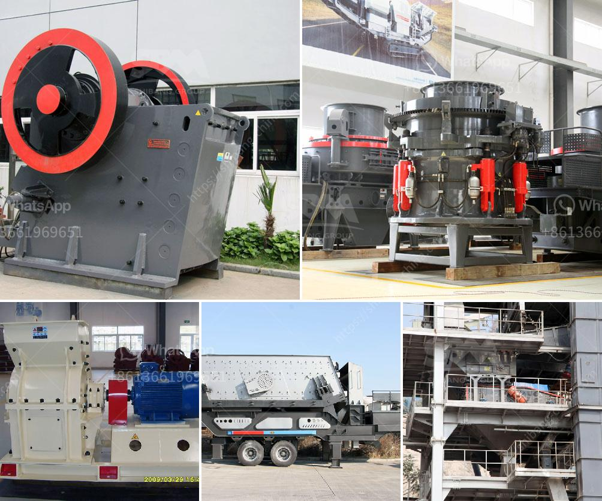

<h3>service de carbonate de calcium de broyage</h3>
Le carbonate de calcium est une substance minérale couramment utilisée dans de nombreux secteurs industriels tels que la construction, l'agriculture, l'alimentation et les produits pharmaceutiques. Il est utilisé comme additif pour augmenter la résistance et la durabilité du béton, pour améliorer la qualité des sols agricoles, pour fournir des nutriments essentiels aux animaux et pour renforcer les produits pharmaceutiques.

Cependant, pour pouvoir utiliser le carbonate de calcium dans ces différents domaines, il est nécessaire de le broyer en une poudre fine et homogène. Ce processus de broyage est essentiel pour obtenir les propriétés souhaitées du carbonate de calcium, telles que la granulométrie, la morphologie et la distribution des particules.

Pour cette raison, des services de broyage de carbonate de calcium sont disponibles sur le marché. Ces services offrent des installations spécialisées avec des équipements et des machines de pointe qui sont capables de broyer le carbonate de calcium en particules de différentes tailles selon les besoins des clients.

Les avantages du service de broyage de carbonate de calcium sont nombreux. Tout d'abord, le broyage garantit une distribution uniforme des particules, ce qui facilite son utilisation dans diverses applications. De plus, le broyage permet de réduire la taille des particules, ce qui améliore l'efficacité et l'absorption du carbonate de calcium dans les matériaux ou les produits finis. En outre, le broyage permet d'éliminer les impuretés et les contaminants présents dans le carbonate de calcium brut, ce qui garantit une qualité optimale du produit final.

En conclusion, le service de broyage de carbonate de calcium est essentiel pour obtenir les propriétés souhaitées de cette substance minérale utilisée dans de nombreux secteurs industriels. Ces services de broyage offrent une solution pratique et efficace pour transformer le carbonate de calcium brut en une poudre fine et homogène, prête à être utilisée dans diverses applications.
<h3>Contact us</h3><ul><li><strong>Whatsapp:&nbsp;<a href="https://wa.me/8613661969651">+8613661969651</a></strong></li><li><a href="https://swt.shibang-china.com/?git&amp;zhl&amp;service de carbonate de calcium de broyage"><strong>Online Service(chat now)</strong></a></li></ul><h3>Related</h3><ul><li><a href='small scale gold mining in kadoma zimbabwe.md'>small scale gold mining in kadoma zimbabwe</a></li><li><a href='mobile vibrating screen.md'>mobile vibrating screen</a></li><li><a href='cost 100tph stone crusher in india.md'>cost 100tph stone crusher in india</a></li><li><a href='crusher philippines.md'>crusher philippines</a></li><li><a href='stone crusher german company.md'>stone crusher german company</a></li></ul>