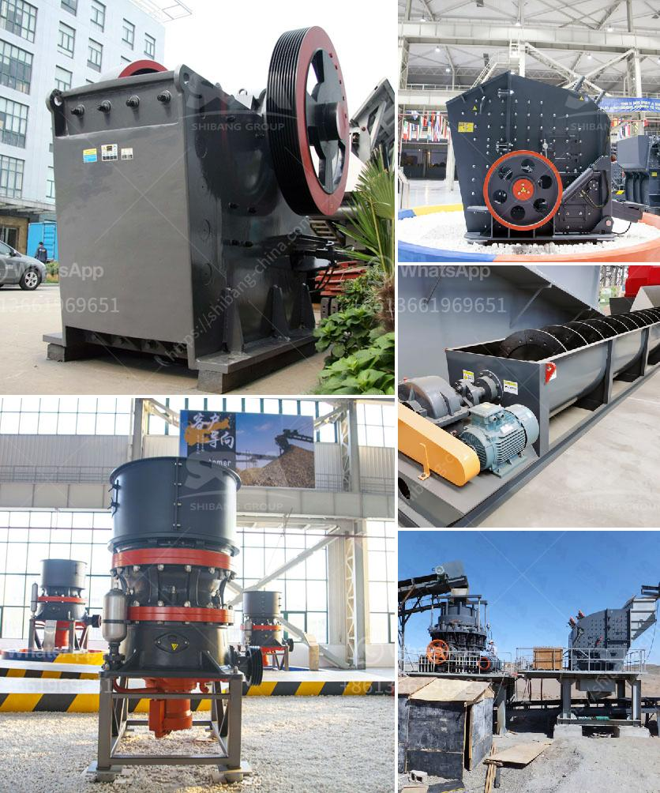

<h3>set up a quarry for ballast stones south africa</h3>
Setting up a quarry to extract ballast stones in South Africa is a significant undertaking that involves carefully considering various factors. First and foremost, it is essential to identify the site for the quarry and ascertain its suitability for extracting stones. Once this is determined, acquiring the necessary permits and licenses from the relevant authorities becomes the next crucial step.

When establishing a quarry, it is essential to conduct geological surveys to assess the quality and quantity of ballast stones available in the area. This ensures that the quarry's operation will be economically viable and able to meet the demand for these stones. Adequate machinery and equipment are required to extract, process, and transport the stones efficiently.

Additionally, it is imperative to consider the environmental impact of the quarry operation. Proper measures must be taken to prevent or minimize any negative effects on the ecosystem, including soil erosion, water pollution, and noise pollution. Compliance with environmental regulations and obtaining environmental clearances is vital in this regard.

Another crucial aspect is considering the labor force required for quarry operations. Hiring skilled and experienced workers is essential for the efficient and safe extraction of ballast stones. Providing proper training and ensuring compliance with health and safety regulations are also essential to protect the workers' well-being.

Transportation logistics should not be overlooked when setting up a quarry for ballast stones. The proximity to road or railway networks is crucial for the efficient distribution of the extracted stones to construction sites. Adequate transportation infrastructure, such as trucks or trains, must be employed to ensure a smooth flow of materials.

Lastly, developing a marketing strategy to promote the quarry's products is essential to attract clients. Forming partnerships with construction companies, suppliers, and government agencies can help ensure a steady demand for the ballast stones.

In conclusion, setting up a quarry for ballast stones in South Africa requires careful planning and consideration. Factors such as site selection, permits, machinery, labor force, environmental impact, and transportation logistics must be thoroughly evaluated. By following these steps and adhering to all necessary regulations, the quarry can become a successful and sustainable venture.
<h3>Contact us</h3><ul><li><strong>Whatsapp:&nbsp;<a href="https://wa.me/8613661969651">+8613661969651</a></strong></li><li><a href="https://swt.shibang-china.com/?git&amp;zhl&amp;set up a quarry for ballast stones south africa"><strong>Online Service(chat now)</strong></a></li></ul><h3>Related</h3><ul><li><a href='small cement plant for sale.md'>small cement plant for sale</a></li><li><a href='type of conveyors belt pdf.md'>type of conveyors belt pdf</a></li><li><a href='model project of soap stone powder.md'>model project of soap stone powder</a></li><li><a href='south africa mobile crusher.md'>south africa mobile crusher</a></li><li><a href='coarse ash grinding mill equipment.md'>coarse ash grinding mill equipment</a></li></ul>