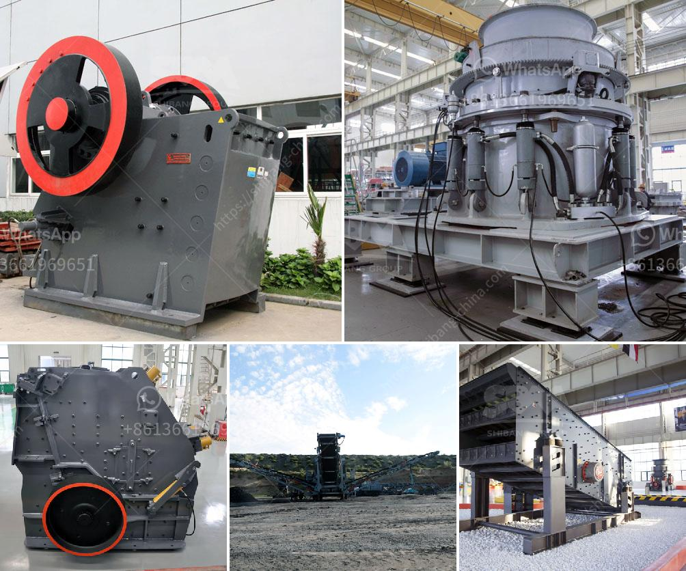

<h3>setting up limestone processing plant in nigeria</h3>
Nigeria is richly endowed with limestone deposits, considered as some of the best in Africa. Limestone is a vital raw material for numerous construction activities, including the production of cement, concrete, and lime. Hence, any aspiring entrepreneur that intends to venture into this business must obtain requisite permits and licenses to begin the mining and processing of limestone.

A limestone processing plant is a facility where various processes are used to extract and refine limestone for commercial use. This article takes you through the steps involved in setting up a limestone processing plant in Nigeria.

The first step in setting up a limestone processing plant is to locate a deposit that has sufficient quantity and quality of limestone suitable for commercial use. Several geological surveys exist in Nigeria, which can provide information on areas with limestone deposits. Engaging a geologist or mining consultant will be helpful in accurately identifying and evaluating the deposit.

Once a suitable deposit is identified, you need to secure the necessary mining leases and licenses from the appropriate government agency. The Nigerian Mining Cadastre Office (MCO) is responsible for issuing mining licenses and permits. Engaging a lawyer with expertise in mining laws can help expedite this process and ensure compliance with all legal requirements.

As part of the regulatory requirements, you must conduct an Environmental Impact Assessment (EIA) to evaluate the potential environmental and social impacts of the proposed limestone processing plant. The EIA report will provide critical information to obtain an Environmental Impact Assessment Certificate from the relevant government agency.

Once the necessary permits and licenses are obtained, the next step is to design and construct the limestone processing plant. Engage an experienced engineering firm to develop an appropriate plant layout and select the necessary equipment and machinery. Consideration should be given to aspects such as crushing, grinding, storage, and transportation facilities.

Setting up a limestone processing plant requires significant capital investment. As an entrepreneur, you can fund the project through personal savings, loans from financial institutions, or partnership arrangements. Prepare a comprehensive business plan that outlines the project's financial projections to attract potential investors or secure loans.

To operate the limestone processing plant efficiently, you need a skilled and dedicated workforce. Recruit individuals with experience in the mining and limestone processing industry. Additionally, arrange training programs to update their knowledge and skills in operating the plant and adhering to safety regulations.

To legally operate a limestone processing plant, obtain necessary permits and certifications from relevant government agencies. These include operational permits, food and drug administration permits (if applicable), and employee health and safety certifications.

Setting up a limestone processing plant in Nigeria can be a lucrative and rewarding venture. With abundant limestone deposits and the increasing demand for cement and other construction materials, there is a promising market for limestone products. However, it is crucial to follow all the necessary steps, obtain required permits and licenses, and implement best practices to ensure a successful and sustainable operation.
<h3>Contact us</h3><ul><li><strong>Whatsapp:&nbsp;<a href="https://wa.me/8613661969651">+8613661969651</a></strong></li><li><a href="https://swt.shibang-china.com/?git&amp;zhl&amp;setting up limestone processing plant in nigeria"><strong>Online Service(chat now)</strong></a></li></ul><h3>Related</h3><ul><li><a href='copper oxide processing plant.md'>copper oxide processing plant</a></li><li><a href='jaw crusher for barite crushing.md'>jaw crusher for barite crushing</a></li><li><a href='iron ore upgrading plant equipment.md'>iron ore upgrading plant equipment</a></li><li><a href='stone quarry machines.md'>stone quarry machines</a></li><li><a href='industrial crusher machine.md'>industrial crusher machine</a></li></ul>