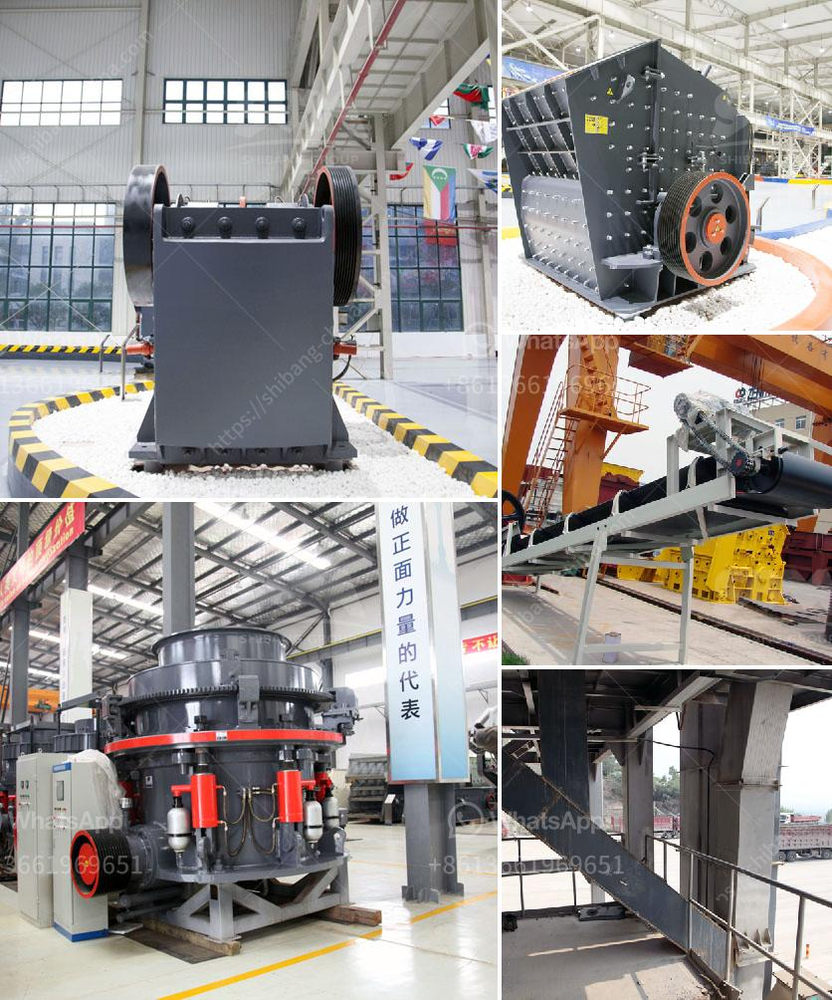

<h3>setting up of a stone quarry plant in nigeria</h3>
Setting up a quarry plant is like injection into the real (productive) sector of the economy. Nigeria is richly endowed with granite stone and other related solid minerals like marble, dolomite and basalt. It is found in Enugu, Ebonyi, Kogi, Plateau, Ogun, Oyo, Osun and Ekiti states. Hence, granite is among the most available and affordable building material.

Nigeria been a country located in the tropics has these rocks in commercial quantity and it is a means of livelihood for many in some parts of the country.

In the past, it was mined manually but now there are sophisticated equipment that make quarrying very easy.

Lagos as a cosmopolitan city developing by the day cannot do without granite. There is high demand for the product in Lagos, Ibadan, Abeokuta and other surrounding cities.

The cost of the machinery required for the crushing of the granite make up between 60 and 70 per cent of the cost of establishing the business and is dependent on site being opened. To achieve maximum productivity and reduce costs, the plant must be located close to the area where the stones are extracted.

The three basic steps involved in quarrying are extraction, crushing and grinding. Some of the equipment needed include crushers, excavators, dumpers, pay loaders, generators, and conveyor belts.

Before the installation of any machinery, it is important to ensure that a comprehensive assessment of the quarry site has been carried out to ensure the availability of necessary resources and safety of workers on site.

Setting up a quarry plant is not an easy task as it involves extensive excavation, hauling of suitable rocks and stones to a crushing site, plus the processing to the finished product. The machinery and equipment used in quarrying are Screens, crushers, shredders and rock drills. We provide all the leading manufacturers such as: Extec, Tesab, Fintec, Brown Lennox, Pegson, Powerscreen and Terex-Finlay.

We will match your project requirements with a machine that has the specification capable of carrying out the job you need.
<h3>Contact us</h3><ul><li><strong>Whatsapp:&nbsp;<a href="https://wa.me/8613661969651">+8613661969651</a></strong></li><li><a href="https://swt.shibang-china.com/?git&amp;zhl&amp;setting up of a stone quarry plant in nigeria"><strong>Online Service(chat now)</strong></a></li></ul><h3>Related</h3><ul><li><a href='list the equipment use in diamond mining.md'>list the equipment use in diamond mining</a></li><li><a href='powder mill machines.md'>powder mill machines</a></li><li><a href='to ton hr rock crushers.md'>to ton hr rock crushers</a></li><li><a href='clay beneficiation.md'>clay beneficiation</a></li><li><a href='silica sand import in europe.md'>silica sand import in europe</a></li></ul>