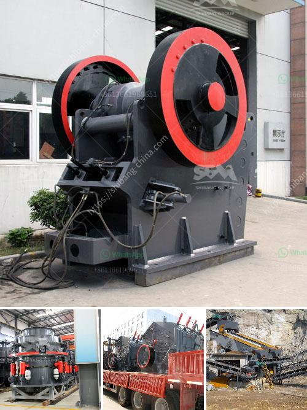

<h3>sewa mobil crusher di kaltim</h3>
The mining industry plays a vital role in the economic development of Indonesia, particularly in the province of East Kalimantan. This region is known for its abundant reserves of coal, which has attracted many mining companies to establish their operations in the area. However, the mining process requires heavy machinery and equipment, including crushers, to break down the rock and extract the valuable minerals. Here, the concept of sewa mobil crusher di Kaltim, or renting mobile crushers in East Kalimantan, comes into play.

Sewa mobil crusher di Kaltim offers a practical solution to the mining industry's need for cost-effective and efficient crushers. These rental services provide a mobile fleet of crushers that can be transported to various mining sites throughout East Kalimantan. The crushers are available in different sizes and configurations, depending on the specific requirements of the project.

The key advantage of opting for sewa mobil crusher di Kaltim is the flexibility it offers. Rather than investing in a fixed crusher, companies can rent the equipment they need for the duration of their mining operations. This means that they do not have to worry about the high initial cost of purchasing a crusher or the ongoing maintenance and servicing expenses.

Another significant benefit of renting mobile crushers is that it allows mining companies to adapt to changing project requirements. In the mining industry, the extraction process often involves moving from one spot to another as new deposits are discovered. With sewa mobil crusher di Kaltim, companies can easily relocate and set up the equipment at different mining sites, enabling them to maximize their productivity and efficiency.

Not only does sewa mobil crusher di Kaltim provide convenience and flexibility, but it also ensures optimal performance and productivity. The rental services typically include skilled operators who are trained to operate the crushers effectively and safely. This eliminates the need for mining companies to train their own workforce and allows them to focus on other critical aspects of their operations.

Furthermore, sewa mobil crusher di Kaltim minimizes the risk of equipment downtime. If a rented crusher breaks down or requires maintenance, the rental company will promptly replace the equipment, ensuring that there is minimal disruption to the mining operations. This is a significant advantage in an industry where time is money, and delays can lead to substantial financial losses.

In conclusion, sewa mobil crusher di Kaltim offers a practical and cost-effective solution to the mining industry's equipment needs. By renting mobile crushers, mining companies in East Kalimantan can enjoy the flexibility, convenience, and efficient performance of these machines without the burden of purchasing and maintaining them. With these rental services, mining companies can focus on extracting valuable minerals while leaving the equipment logistics to the experts. As the demand for coal and other minerals continues to grow, sewa mobil crusher di Kaltim will undoubtedly play a crucial role in supporting the mining industry's success and development.
<h3>Contact us</h3><ul><li><strong>Whatsapp:&nbsp;<a href="https://wa.me/8613661969651">+8613661969651</a></strong></li><li><a href="https://swt.shibang-china.com/?git&amp;zhl&amp;sewa mobil crusher di kaltim"><strong>Online Service(chat now)</strong></a></li></ul><h3>Related</h3><ul><li><a href='price for stone crusher plant.md'>price for stone crusher plant</a></li><li><a href='mobile crusher malaysia for sell.md'>mobile crusher malaysia for sell</a></li><li><a href='stone crusher manufacturer dhaka.md'>stone crusher manufacturer dhaka</a></li><li><a href='mini cement plant grinding project report.md'>mini cement plant grinding project report</a></li><li><a href='sayaji jaw crusher x specifiion.md'>sayaji jaw crusher x specifiion</a></li></ul>