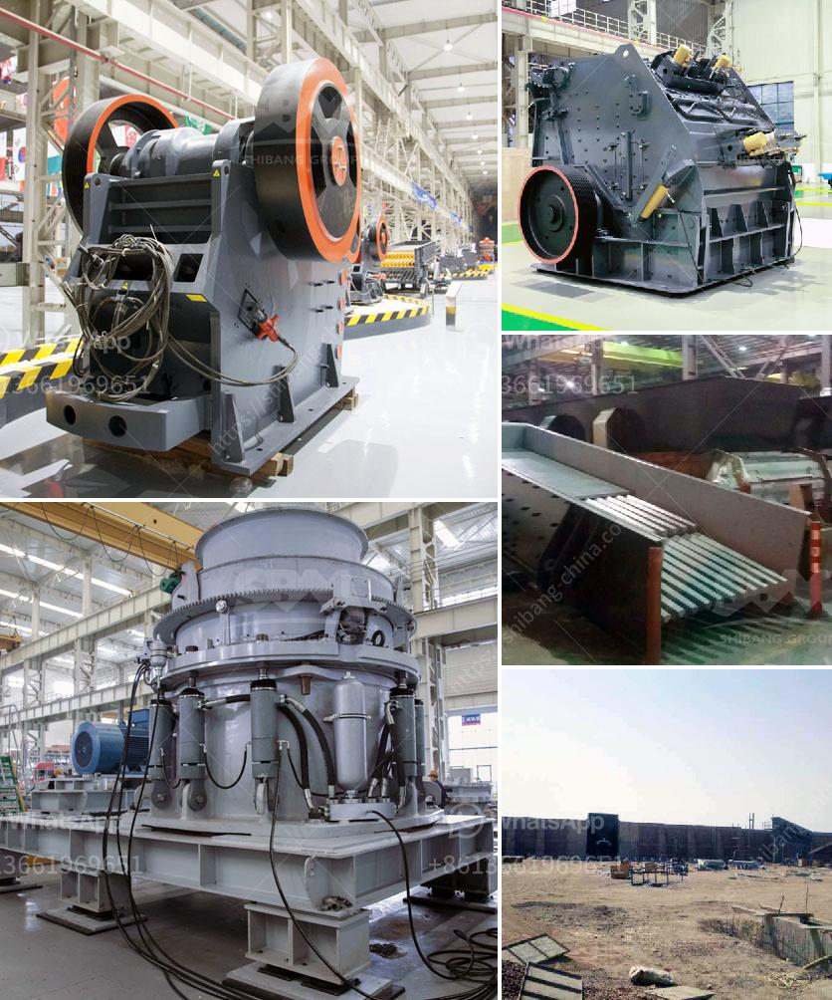

<h3>silica powder grinding machine</h3>
Silica powder grinding machine, also called silica powder grinder or silica powder mill, is a kind of equipment used for grinding silica mineral into powder. It is widely used in grinding process of mining materials in metallurgy, building materials, chemicals, mining minerals areas.

Silica powder grinding machine mainly consists of grinding mill, classifier, duct collector, air blower, electromagnetic vibration feeder, electronic control system, and other components. Silica mineral is grinding by the rotating blade and material itself under the action of collision and friction between particles to finished powder products.

Through the pointing of material, grinding and dispersing, the milling efficiency and quality can be improved. Silica powder grinding machine can be used for processing silica ore with high processing efficiency. It is very important for customers to choose the suitable silica powder grinding machine and ensure the proper operation of the equipment to improve the production efficiency.

It is worthy to mention that, the grinder machine produced by our company has advanced design, great structure, strong grinding capacity, low energy consumption, good sealing, and maintenance-free. It is the first choice for customers to invest in silica powder production.

In conclusion, in the silica powder grinding process, the investment cost of the silica powder grinding machine is about 95% of the total investment cost. After analyzing the relevant information, the final decision is made to obtain the desired benefits.
<h3>Contact us</h3><ul><li><strong>Whatsapp:&nbsp;<a href="https://wa.me/8613661969651">+8613661969651</a></strong></li><li><a href="https://swt.shibang-china.com/?git&amp;zhl&amp;silica powder grinding machine"><strong>Online Service(chat now)</strong></a></li></ul><h3>Related</h3><ul><li><a href='law requirements in stone crushing industry.md'>law requirements in stone crushing industry</a></li><li><a href='limestone crusher plant.md'>limestone crusher plant</a></li><li><a href='suppliers of jaw crushers in south africa.md'>suppliers of jaw crushers in south africa</a></li><li><a href='sample business plan for a stone mining.md'>sample business plan for a stone mining</a></li><li><a href='belt jaw crusher nigeria.md'>belt jaw crusher nigeria</a></li></ul>