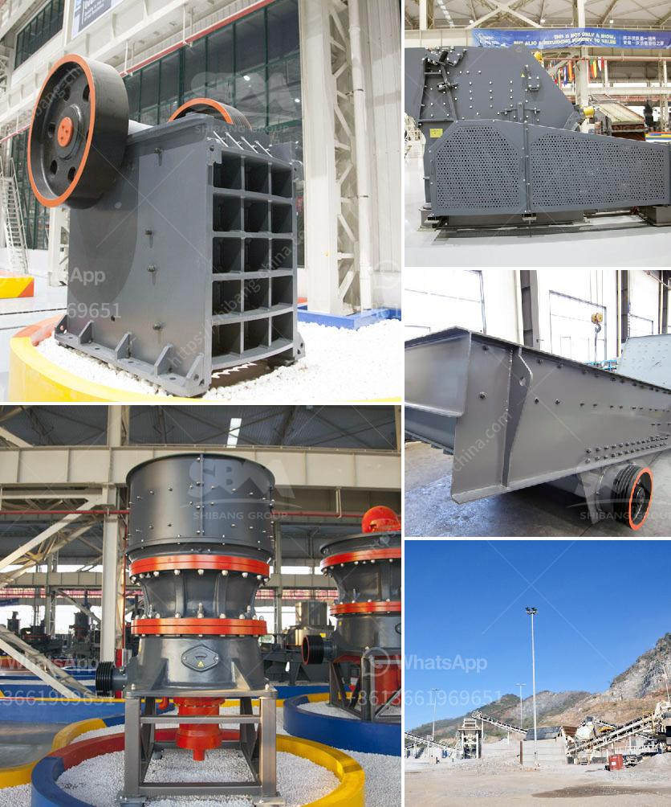

<h3>silica sand import in europe</h3>
Silica sand is one of the most abundant minerals on the planet and has a multitude of uses across various industries. From construction and glass manufacturing to oil and gas extraction, this versatile material plays a crucial role in many essential processes. Europe, with its vast industrial sector, is a significant consumer of silica sand, and the demand for this commodity has been steadily increasing in recent years.

The primary reason behind the surge in silica sand import in Europe is the growing construction and infrastructure development projects taking place across the region. Silica sand is a key ingredient in concrete production, and as construction activities continue to soar, the need for this material becomes paramount. The European construction sector has been experiencing steady growth, particularly in countries such as Germany, France, Spain, and the United Kingdom. This has led to an increased demand for silica sand to meet the requirements of the expanding construction projects.

Another significant factor contributing to the rise in silica sand import is the expanding glass manufacturing industry in Europe. Silica sand is a crucial component in glass production, as it provides strength, durability, and clarity to the final product. The European glass industry is witnessing substantial growth due to the high demand for glass products in various sectors, including automotive, packaging, and construction. As a result, the need for high-quality silica sand has amplified, leading to a surge in import activities.

In addition to its use in construction and glass manufacturing, silica sand is also integral to the oil and gas industry. It is a crucial component in hydraulic fracturing, also known as fracking, which is an extraction technique used to access natural gas and oil reserves. The European energy market heavily relies on natural gas, and the increasing demand for this resource has driven the expansion of fracking operations in the region. Consequently, the need for silica sand, a key ingredient in the fracking fluid, has also grown significantly.

Despite the abundance of silica sand deposits within Europe, the demand often exceeds the available supply, leading to a rise in import activities. The geographical distribution of silica sand deposits is not uniform, and the quality of local sources may not always meet the specific requirements of various industries. As a result, European countries heavily rely on imported silica sand to fulfill their industrial needs.

The main exporters of silica sand to Europe are countries such as Egypt, Belgium, Germany, Spain, and the Netherlands. These countries possess large silica sand reserves and have established efficient mining and processing operations. Additionally, some Eastern European countries have also emerged as significant silica sand suppliers to Europe, offering competitive prices and high-quality products.

In conclusion, the import of silica sand in Europe has been on the rise due to the growing demand from the construction, glass manufacturing, and oil and gas industries. The expansion of construction projects, the flourishing glass market, and the increasing reliance on natural gas have all contributed to the surge in import activities. While Europe has its own silica sand reserves, the inability to meet the demand has led to significant imports from countries such as Egypt, Belgium, Germany, Spain, and the Netherlands. As the demand for silica sand continues to grow, the import market is expected to expand further in the coming years.
<h3>Contact us</h3><ul><li><strong>Whatsapp:&nbsp;<a href="https://wa.me/8613661969651">+8613661969651</a></strong></li><li><a href="https://swt.shibang-china.com/?git&amp;zhl&amp;silica sand import in europe"><strong>Online Service(chat now)</strong></a></li></ul><h3>Related</h3><ul><li><a href='jaw rock crusher price by owner.md'>jaw rock crusher price by owner</a></li><li><a href='screen vibrating screen for sand.md'>screen vibrating screen for sand</a></li><li><a href='hammer mill 150 250.md'>hammer mill 150 250</a></li><li><a href='dolomite stone crusher plant.md'>dolomite stone crusher plant</a></li><li><a href='low cost jaw crusher for sale in ethiopia.md'>low cost jaw crusher for sale in ethiopia</a></li></ul>