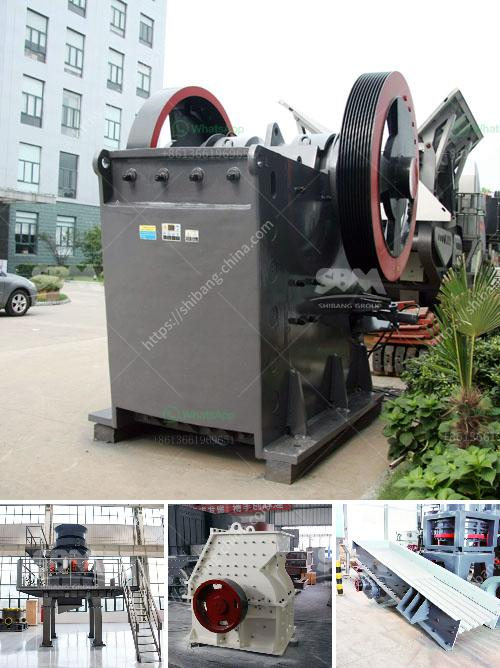

<h3>silica sand machinery manufacture</h3>
Silica sand, also known as quartz sand or industrial sand, is a crucial material used in the production of a wide range of products. The raw materials for these products include glass bottles, fiberglass, ceramics, paints, coatings, and even electronic components. With the rapid development of industries such as construction, foundry, and oil and gas, the demand for high-quality silica sand is on the rise.

To meet this demand, silica sand machinery manufacturers like Sinonine have adopted advanced technology to produce high-quality equipment. These machines, including crushing equipment, grinding equipment, and screening equipment, are essential for the processing of silica sand. They are used for crushing, grinding, and processing purposes in all kinds of industries.

Silica sand processing plants generate large amounts of silica sand dust, which is a major concern for the operators of these plants. To combat this issue, manufacturers have developed equipment that can reduce the amount of dust generated during the processing of silica sand. Some of the techniques used to control dust emissions include the use of water sprays, cyclones, and bag filters. These measures help to create a safe and healthy working environment for plant operators.

Crushing equipment is used in the first stage of silica sand processing. It breaks the raw material into small pieces that can be further processed. Jaw crushers, cone crushers, and impact crushers are commonly used in this process. Different crushers have different crushing capacities and produce different particle sizes. Manufacturers can customize their equipment based on the specific requirements of their clients.

Grinding equipment is used to reduce the silica sand into smaller particles suitable for further processing. Ball mills, rod mills, and vertical mills are commonly used for grinding silica sand. Quartz sand dryer is a drying equipment that is used to dry all kinds of quartz sand, such as river sand, yellow sand, silica sand, etc. It is designed to handle high-volume and high-temperature drying.

Screening equipment is used to separate the silica sand particles according to their size. Vibrating screens and trommel screens are commonly used for this purpose. Vibrating screens are equipped with mesh screens that allow only particles of a certain size to pass through, while larger particles are retained. Trommel screens, on the other hand, rotate and separate the silica sand particles based on their size. These screens are widely used in the foundry industry for the separation of silica sand from other materials.

In conclusion, the manufacture of silica sand machinery plays a crucial role in ensuring the supply of high-quality silica sand for various industries. The use of advanced technology and equipment helps to produce silica sand that meets the specific requirements of clients. Dust control measures are also employed to create a safe working environment for plant operators. With the increasing demand for silica sand, manufacturers are constantly improving and innovating their machinery to meet the needs of the industry.
<h3>Contact us</h3><ul><li><strong>Whatsapp:&nbsp;<a href="https://wa.me/8613661969651">+8613661969651</a></strong></li><li><a href="https://swt.shibang-china.com/?git&amp;zhl&amp;silica sand machinery manufacture"><strong>Online Service(chat now)</strong></a></li></ul><h3>Related</h3><ul><li><a href='cement grinding units in india basalt crusher quotes.md'>cement grinding units in india basalt crusher quotes</a></li><li><a href='metal pulverizer crusher suppliers.md'>metal pulverizer crusher suppliers</a></li><li><a href='stone crusher machine uk.md'>stone crusher machine uk</a></li><li><a href='india jaw crusher of small capacity.md'>india jaw crusher of small capacity</a></li><li><a href='belt price conveyor belt price malaysia.md'>belt price conveyor belt price malaysia</a></li></ul>