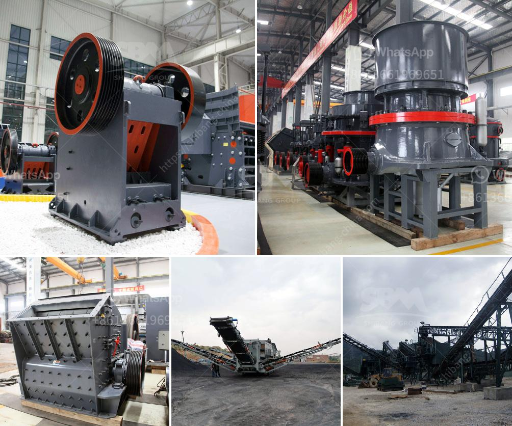

<h3>silica sand mill</h3>
Silica sand, also known as quartz sand, is a common material used in various industries, including glass manufacturing, foundry, construction, and chemical production. Due to its abundant availability and high purity, it is widely sought after. But what happens when this raw material needs to be processed to meet specific size or quality requirements? That's where a silica sand mill comes into play.

A silica sand mill is a machine designed to grind silica sand into a desired particle size or fine powder. It consists of a cylindrical shell, rotating at a high speed, spinning on its axis, which contains grinding media (balls or pebbles) made of different materials, such as steel, ceramic, or natural stone. The grinding media crush and grind the silica sand particles, reducing them to the desired size.

One of the main applications of a silica sand mill is in the production of glass. Silica sand is a key ingredient in glass manufacturing, providing strength, transparency, and other crucial properties. By using a silica sand mill, glass manufacturers can achieve the desired particle size distribution and control the quality of silica sand used in their glass compositions.

Another significant use of a silica sand mill is in the foundry industry. Foundries require a high-quality silica sand with specific size fractions to produce molds and cores for casting various metal alloys. With the help of a silica sand mill, foundries can refine and control the particle size distribution of the sand, ensuring consistency and improving the casting process's efficiency.

Apart from the glass and foundry industries, a silica sand mill is also utilized in other sectors. In construction, it is used as filtration media, improving water quality and preventing clogging in drainage systems. Silica sand is also a vital component in the production of ceramics, paints, coatings, and other chemical products.

To ensure the efficient operation of a silica sand mill, various factors are considered. The material's initial size, its hardness, and the desired final particle size all play a role in determining the mill's design and specifications. The type and size of grinding media, the rotation speed, and the mill's capacity are also essential parameters to optimize the milling process.

Advancements in grinding technology have led to the development of more efficient and energy-saving silica sand mills. For instance, some mills use air classifiers to separate and control the desired particle size distribution more precisely, reducing energy consumption and improving overall performance. Additionally, automation systems and sensor technologies have been integrated into modern mills, allowing for real-time monitoring and precise control of the milling process.

In conclusion, a silica sand mill plays a crucial role in the mining industry. It enables the processing and refinement of silica sand to meet various industry requirements, such as glass manufacturing, foundry operations, and construction applications. As the demand for silica sand grows, the development of more advanced and efficient silica sand mills becomes imperative. Embracing technological advancements will not only enhance productivity but also reduce energy consumption, contributing to a more sustainable and environmentally friendly mining industry.
<h3>Contact us</h3><ul><li><strong>Whatsapp:&nbsp;<a href="https://wa.me/8613661969651">+8613661969651</a></strong></li><li><a href="https://swt.shibang-china.com/?git&amp;zhl&amp;silica sand mill"><strong>Online Service(chat now)</strong></a></li></ul><h3>Related</h3><ul><li><a href='150 ton per hour gold wash plant.md'>150 ton per hour gold wash plant</a></li><li><a href='cost a stone crusher.md'>cost a stone crusher</a></li><li><a href='granite crusher in kenya.md'>granite crusher in kenya</a></li><li><a href='vibrating screen for silica sand.md'>vibrating screen for silica sand</a></li><li><a href='gold shaker wash plant trommel for sale used new.md'>gold shaker wash plant trommel for sale used new</a></li></ul>