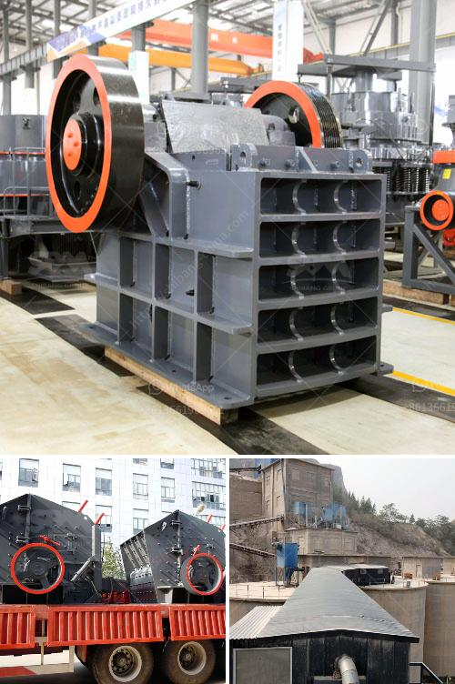

<h3>silica sand mining machine</h3>
Silica sand mining is a lucrative but controversial industry that has the potential to cause significant environmental impacts if not managed properly. Silica sand, also known as quartz sand, is used in industries such as glass, ceramics, metallurgy, and oil and gas extraction.

Silica sand mining has been a contentious issue in various parts of the world. Proponents of silica sand mining claim that the land use impacts of mining can be mitigated through the use of advanced machinery and equipment. Other proponents claim that silica sand mining should be allowed because it could help buffer the local economy against fluctuations in other industries. These arguments overlook the many negative consequences of the industry, such as the potential for air and water pollution.

Silica sand mining machines SBM is a professional silica mining machine manufacturer, our jaw crusher is used for silica sand primary, and vsi crusher used for fine crushing,if you need any silica mining machine,contact us. Silica sand mining in India

In mineral planning, the term ‘reserves’ or ‘mineral reserves’ refers to material that has a valid planning permission for mineral extraction. Permitted reserves of silica sand include a wide range of different qualities, many of which are not interchangeable in use. The exploration drilling programme lost a significant proportion of its budget as a result of a decline in reserves and production. Exploration and mitigation strategies are influenced by the presence of sealed units of rock. Data on intercalation of sandstone with layers of clays and iron-rich minerals are important indicators of the economic viability of deposits.

The extraction of silica sand can be done through various methods including hard rock mining, open-pit mining, and dredging. However, because of the wide range of properties, the exploitation of silica sand requires the use of specific equipment. The most common equipment that is used in the mining of silica sand includes crushers, classifiers, sieves, and drying equipment.

In conclusion, silica sand mining, although controversial, is here to stay. Companies that want to continue extracting silica sand must look for more environmentally friendly and sustainable methods. If not, the industry risks being shut down altogether. Silica sand mining is highly debated, and there are many arguments for and against it. However, the demand for silica sand continues to rise, especially in industries like construction, which can lead to further mining activities and potential environmental impacts. It is crucial for mining companies to invest in advanced machinery and equipment that can mitigate these impacts and ensure the sustainable extraction of silica sand.
<h3>Contact us</h3><ul><li><strong>Whatsapp:&nbsp;<a href="https://wa.me/8613661969651">+8613661969651</a></strong></li><li><a href="https://swt.shibang-china.com/?git&amp;zhl&amp;silica sand mining machine"><strong>Online Service(chat now)</strong></a></li></ul><h3>Related</h3><ul><li><a href='iron ore crusher machine.md'>iron ore crusher machine</a></li><li><a href='smallest mobile jaw crusher for sale south africa.md'>smallest mobile jaw crusher for sale south africa</a></li><li><a href='talcum powder supplier for production.md'>talcum powder supplier for production</a></li><li><a href='mobile crusher on rent for iron ore.md'>mobile crusher on rent for iron ore</a></li><li><a href='impact crusher specifications.md'>impact crusher specifications</a></li></ul>