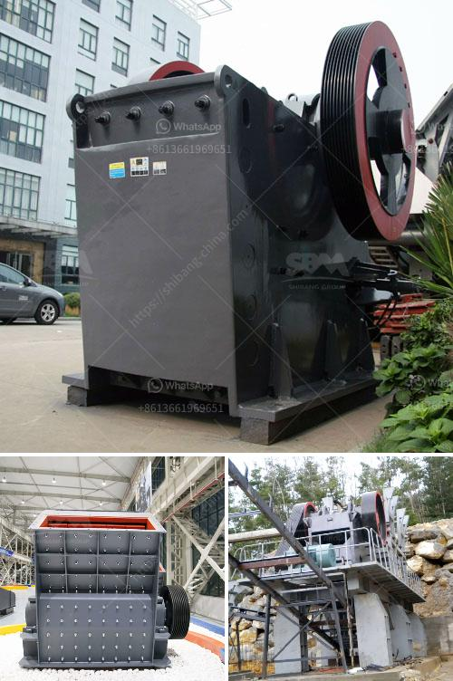

<h3>silica sand washing machine in south africa</h3>
Silica sand washing machine in south Africa is the best choice for impurity removal in sand making process, and upgrading silica sand effectively. The pure sand extracted from sand mining is mixed with impurities like clay, silt, and other unwanted substances that are not suitable for various industrial applications. These impurities must be removed before the sand can be used for construction, concrete production, or other purposes. Silica sand washing machine is widely used to wash and select materials in sand and gravel field, mining, construction materials, transportation, chemical industry, water conservancy and hydropower, concrete mixing station and other industries.

Silica sand washing machine is also called wheel-type sand washer. It is designed with reasonable structure, novel sealing structure, transmission device, lubricating seal system and low noise, reasonable structure makes this machine easy to maintain and its layout is simple and practical. The impeller drive bearing device is isolated from water and water-receiving materials, which greatly avoids the damage to bearing caused by water, sand and contaminants. Therefore, the sand washing machine has a longer service life compared to traditional sand washing machines.

The silica sand washing machine produced by our company adopts advanced technology at home and abroad, combined with the actual situation of our country's sand and stone industry. After repeated test and improvement, it has achieved the function of one-time wash, dehydration and classification. The cleanliness of finished materials is high, and the grain size is even. The transmission part of the sand and gravel washer is isolated from water and sand, so the failure rate is much lower than that of the current common sand washing machine. As a professional manufacturer of mining machinery and equipment, we are committed to providing customers with high-quality equipment and efficient services.

In recent years, silica sand washing machines have been widely used in South Africa, and customers have a great interest in our products. Silica sand washing machine is widely used to wash sand sand stone and other hard materials, a variety of ores and other materials may be grinding to fine sand washing. Silica sand washing machine is suitable for construction sites, sand and gravel plants, hydropower stations, concrete dam sites, post and telecommunications poles, and the seven sand for foundry, quartz sand for glassworks and pressure sand for oil well backfilling. Graded products can be produced, and graded products can be used to filter the tailings and improve the quality of sand.

The South African silica sand washing machine is used to clean the dust particles and impurities involved in the sands and gravels of mining, construction sites, sand and gravel plants and water conservancy sites. Equipped with hydraulic opening device, so it's convenient to repair and replace in the south Africa silica sand washing machine. While the hydraulic system can make the machine run smoothly after the accumulative damage caused by load increasing, and it also could effectively reject the possible impacts between constituents in vain while the machine stop running suddenly. This greatly reduces the maintenance frequency and the cost of maintenance and dramatically reduced the damage to the internal working components of the entire sand washing machine.
<h3>Contact us</h3><ul><li><strong>Whatsapp:&nbsp;<a href="https://wa.me/8613661969651">+8613661969651</a></strong></li><li><a href="https://swt.shibang-china.com/?git&amp;zhl&amp;silica sand washing machine in south africa"><strong>Online Service(chat now)</strong></a></li></ul><h3>Related</h3><ul><li><a href='hammer mill for sale ebay.md'>hammer mill for sale ebay</a></li><li><a href='small hammer mill grinder 10 mm.md'>small hammer mill grinder 10 mm</a></li><li><a href='marble grinder mill machine price in pakistan.md'>marble grinder mill machine price in pakistan</a></li><li><a href='grinding mills in usa.md'>grinding mills in usa</a></li><li><a href='hammer mill ghana.md'>hammer mill ghana</a></li></ul>