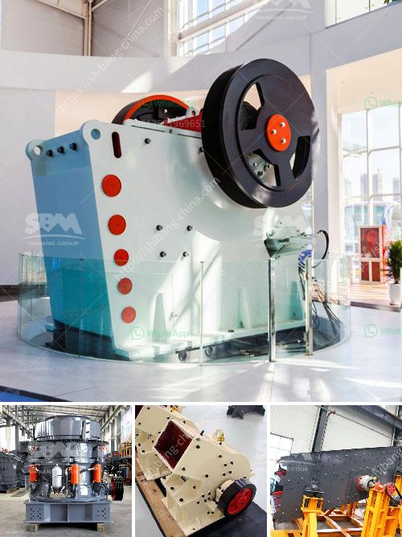

<h3>silica sand washing plant china</h3>
Silica sand is one of the most commonly used sand types in the world. It is used in a wide range of industries, including construction, glass manufacturing, and oil and gas extraction. As the demand for this valuable resource continues to rise, the need for effective silica sand washing plants also increases.

China is one of the largest producers and consumers of silica sand in the world. To meet the ever-growing demand, Chinese manufacturers have embraced advanced technology to improve the efficiency and quality of their silica sand washing plants. These plants are designed to remove impurities such as clay, iron oxide, and other mineral particles, ensuring the highest quality of silica sand output.

The silica sand washing plants in China utilize advanced equipment such as hydrocyclones, attrition scrubbers, spiral sand washers, and automatic control systems to achieve the desired degree of purity. These plants can effectively remove impurities from silica sand, resulting in a consistent and high-quality final product.

One of the key advantages of silica sand washing plants in China is their ability to increase the productivity of mines and quarries. By removing impurities from raw silica sand, these plants optimize the efficiency of downstream processes such as glass manufacturing, water treatment, and hydraulic fracking. This not only helps improve the overall productivity of these industries but also reduces environmental impact by minimizing the need for additional resources.

In addition to improving productivity, silica sand washing plants in China also prioritize product safety and environmental sustainability. These plants are equipped with advanced dust control systems to minimize air pollution during the washing process. They also incorporate water recycling systems, reducing the overall water consumption and conserving this precious resource.

All in all, silica sand washing plants in China play a crucial role in meeting the rising demand for high-quality silica sand. With their advanced technology, efficiency, and focus on environmental sustainability, these plants are helping drive the growth of industries that rely on silica sand, both in China and around the world.
<h3>Contact us</h3><ul><li><strong>Whatsapp:&nbsp;<a href="https://wa.me/8613661969651">+8613661969651</a></strong></li><li><a href="https://swt.shibang-china.com/?git&amp;zhl&amp;silica sand washing plant china"><strong>Online Service(chat now)</strong></a></li></ul><h3>Related</h3><ul><li><a href='gold crusher for sale in brazil.md'>gold crusher for sale in brazil</a></li><li><a href='fine powder grinder commercial.md'>fine powder grinder commercial</a></li><li><a href='gravel washing plant for sale in uk.md'>gravel washing plant for sale in uk</a></li><li><a href='stone crusher plant tph layout.md'>stone crusher plant tph layout</a></li><li><a href='stone crusher manufacturers.md'>stone crusher manufacturers</a></li></ul>