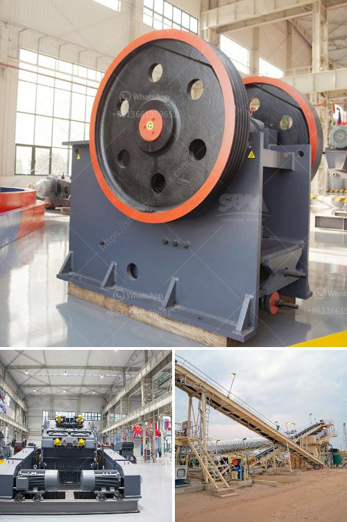

<h3>silica sand washing process</h3>
Silica sand is a mineral resource commonly used in a wide range of industrial applications, including construction, glass-making, and hydraulic fracturing (fracking). It is used as a proppant by oil and gas companies to enhance the flow of oil and gas from wells. The washing process of silica sand involves removing foreign particles such as organic matter and clay minerals from it, to make it usable for various industrial purposes.

Various washing techniques have been developed over the years to ensure efficient and effective removal of these impurities. The process starts with the raw silica sand being washed in a series of spiral separators to remove contaminants such as clay minerals and organic matter. The sand is then screened for size, and any oversized particles are returned to the spiral separators for further processing.

After this initial washing process, the silica sand is transferred to a hydrocyclone for further cleaning. Hydrocyclones are used to separate and classify particles based on their size and density. In the case of silica sand, the hydrocyclone performs the crucial task of removing any remaining fine particles that may have escaped the earlier washing stages.

Once the washing process is complete, the silica sand is dewatered using a series of high-frequency screens that remove excess water from the sand particles. The dewatered silica sand is then stockpiled and ready for shipment to various customers.

The silica sand washing process not only removes unwanted particles from the sand, but also helps in improving the quality of the end product. This is evident from the reduced levels of silt, clay minerals, and organic matter present in the washed sand. Moreover, the washed silica sand also exhibits improved physical properties such as higher strength and better resistance to abrasion.

In conclusion, the silica sand washing process plays a vital role in producing high-quality silica sand suitable for a variety of industrial applications. It helps to remove unwanted particles and impurities from the sand, resulting in improved quality and enhanced physical properties. With the increasing demand for silica sand, the washing process has become an essential step in ensuring a consistent supply of high-quality sand for various industries.
<h3>Contact us</h3><ul><li><strong>Whatsapp:&nbsp;<a href="https://wa.me/8613661969651">+8613661969651</a></strong></li><li><a href="https://swt.shibang-china.com/?git&amp;zhl&amp;silica sand washing process"><strong>Online Service(chat now)</strong></a></li></ul><h3>Related</h3><ul><li><a href='small jaw crushers.md'>small jaw crushers</a></li><li><a href='gravel making equipment.md'>gravel making equipment</a></li><li><a href='silica sand washing machine in south africa.md'>silica sand washing machine in south africa</a></li><li><a href='coal crusher types.md'>coal crusher types</a></li><li><a href='raymond mills in india.md'>raymond mills in india</a></li></ul>