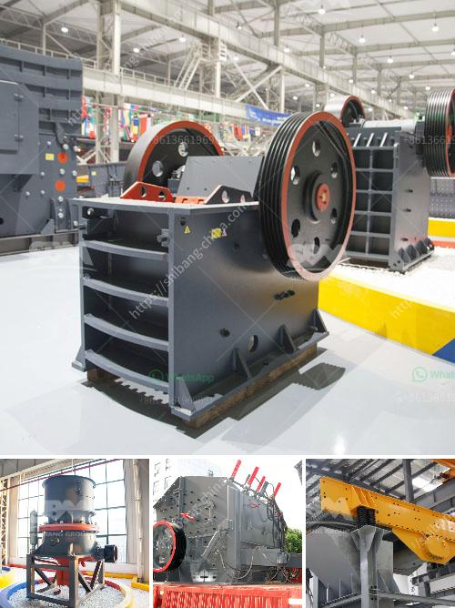

<h3>silica water washing plant price</h3>
Silica water, also known as silica-rich water or silica-enhanced water, is gaining popularity as a health-conscious and mineral-enriched alternative to regular drinking water. It is believed to provide various health benefits including better digestion, improved hair and skin health, and enhanced bone strength.

To meet the growing demand for silica water, many companies have established silica water washing plants. These plants are specifically designed to extract and purify the silica content from the water, ensuring that consumers get the maximum health benefits from each sip. However, the price of setting up and operating such plants can vary significantly based on several factors.

The first significant factor affecting the price of a silica water washing plant is its capacity. The capacity determines how much water can be processed and purified within a given time frame. Plants with larger capacities typically have higher prices compared to smaller units. A large-scale silica water washing plant may be more suitable for commercial purposes, while a smaller one could cater to residential or small-scale production needs.

Another factor that influences the price is the technology used in the purification process. Advanced technologies such as reverse osmosis or ultrafiltration may result in a higher initial investment, but they offer better-quality purification and longevity. These technologies remove impurities, contaminants, and heavy metals, ensuring that only pure and silica-rich water is obtained. On the other hand, plants relying on simpler filtration systems may have a lower price tag but may also deliver lower quality water.

The overall cost of operating a silica water washing plant also needs to be considered. This includes expenses such as electricity, water, labor, maintenance, and raw material (silica-rich water). Efficient plants with automated operations and minimal manual labor can help reduce operational costs in the long run. However, these cost-saving measures may require a higher upfront investment.

Furthermore, geographic location plays a crucial role in determining the price of silica water washing plants. The availability of raw material sources, labor, and utilities can vary depending on the region. Plants located in areas with abundant sources of silica-rich water and low labor costs may have a competitive advantage, resulting in more affordable prices.

It is important to note that the price of a silica water washing plant is not only determined by the initial investment but also the return on investment (ROI) it offers. The demand for silica water is growing, and consumers are increasingly willing to pay a premium for its associated health benefits. Therefore, businesses investing in silica water washing plants can expect a potentially high ROI if marketed and priced appropriately.

In conclusion, the price of a silica water washing plant can range significantly depending on factors such as capacity, technology, operational costs, and geographic location. However, businesses that invest in these plants can tap into the growing market for silica water and potentially achieve substantial returns on their investment. It is essential to carefully consider these factors and conduct thorough market research before making any investment decisions in this industry.
<h3>Contact us</h3><ul><li><strong>Whatsapp:&nbsp;<a href="https://wa.me/8613661969651">+8613661969651</a></strong></li><li><a href="https://swt.shibang-china.com/?git&amp;zhl&amp;silica water washing plant price"><strong>Online Service(chat now)</strong></a></li></ul><h3>Related</h3><ul><li><a href='powder mill machines.md'>powder mill machines</a></li><li><a href='design of harmer mill.md'>design of harmer mill</a></li><li><a href='trackmounted mobile crusher.md'>track-mounted mobile crusher</a></li><li><a href='design drawing of hopper for crusher.md'>design drawing of hopper for crusher</a></li><li><a href='chain crusher chain crusher suppliers and.md'>chain crusher chain crusher suppliers and</a></li></ul>