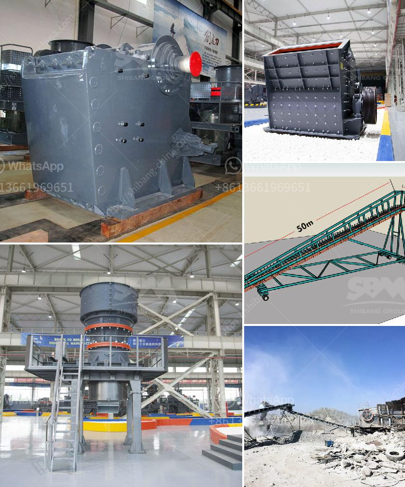

<h3>silicon wafer crusher</h3>
The advancements in technology have led to the emergence of various industries, and one of the most prominent ones is the semiconductor industry. The semiconductor industry plays a crucial role in the development of various electronic devices that we use in our daily lives. From smartphones to computers and even solar panels, semiconductors are the backbone of the digital age.

However, the production of semiconductors involves several intricate processes, and one of them is the manufacturing of silicon wafers. Silicon wafers act as the foundation for the production of semiconductors and are responsible for carrying the microscopic electronic components that make up a chip. Hence, the quality and integrity of silicon wafers are of utmost importance.

To ensure utmost precision and reliability, an innovative solution has emerged in the form of the silicon wafer crusher. The silicon wafer crusher is a cutting-edge device that breaks down silicon wafers into smaller, more manageable pieces. Let's delve into the significance and impact this technology has on the semiconductor industry.

First and foremost, the silicon wafer crusher revolutionizes the semiconductor industry by enhancing the manufacturing process. Traditionally, the silicon wafer production involved a manual cutting process, which was time-consuming and prone to human error. The introduction of the silicon wafer crusher eliminates the need for manual cutting, thereby increasing efficiency and minimizing errors.

Moreover, the silicon wafer crusher ensures uniformity and consistency in the size and thickness of the silicon wafers. This is crucial as any variation in these parameters can adversely affect the performance of the semiconductors. By utilizing the crusher, manufacturers can achieve an unprecedented level of precision, leading to improved overall product quality.

Another noteworthy aspect of the silicon wafer crusher is its ability to reduce waste and cut production costs. During the traditional cutting process, a significant amount of silicon wafers were wasted due to imprecise cutting techniques. This translated into substantial financial losses for manufacturers. With the silicon wafer crusher, waste is minimized, and manufacturers can optimize the utilization of raw materials, thereby reducing costs.

Furthermore, the silicon wafer crusher enables the recycling and reusability of silicon wafers. Semiconductor manufacturing inevitably generates a considerable amount of waste silicon wafers that could not be salvaged using the traditional cutting techniques. However, with the silicon wafer crusher, these discarded wafers can be broken down into usable pieces and reintroduced into the manufacturing process. This not only reduces the environmental impact but also contributes to the sustainability of the semiconductor industry.

In conclusion, the silicon wafer crusher represents a groundbreaking technology that revolutionizes the semiconductor industry. With its ability to improve manufacturing efficiency, enhance precision, minimize waste, and promote sustainability, it has become an indispensable tool for semiconductor manufacturers worldwide. As the demand for semiconductors continues to grow, the silicon wafer crusher will play a pivotal role in ensuring a seamless manufacturing process and delivering high-quality electronic devices.
<h3>Contact us</h3><ul><li><strong>Whatsapp:&nbsp;<a href="https://wa.me/8613661969651">+8613661969651</a></strong></li><li><a href="https://swt.shibang-china.com/?git&amp;zhl&amp;silicon wafer crusher"><strong>Online Service(chat now)</strong></a></li></ul><h3>Related</h3><ul><li><a href='crusher plant design.md'>crusher plant design</a></li><li><a href='gold screening plant.md'>gold screening plant</a></li><li><a href='approach to the problem of a mineral crusher.md'>approach to the problem of a mineral crusher</a></li><li><a href='sand screening machine.md'>sand screening machine</a></li><li><a href='silica sand import in europe.md'>silica sand import in europe</a></li></ul>