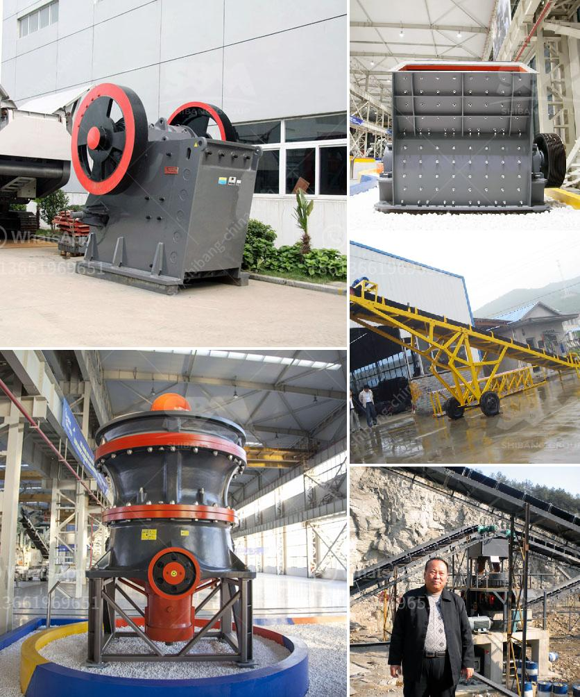

<h3>simple gold mining machinery with prices</h3>
Gold mining has been a lucrative industry for centuries, with its allure and promise of wealth attracting individuals from all walks of life. While large mining operations use heavy machinery and massive equipment to extract gold from the earth, small-scale miners often require more accessible and affordable options. This is where simple gold mining machinery comes into play, offering an efficient and cost-effective solution for those wishing to start their journey in the gold mining industry.

One of the most popular and accessible pieces of gold mining machinery is the gold pan. With its simplicity and ease of use, the gold pan has been a staple tool for prospectors. It allows miners to separate gold from dirt and sand, making it an ideal option for beginners or those with limited resources. Gold pans are available at various prices, ranging from $10 to $30, depending on the material and size.

Another simple and affordable machinery is the sluice box. The sluice box is designed to capture gold particles as water flows through it, utilizing riffles to trap gold and other heavy minerals. They come in different sizes and configurations, with prices ranging from $50 to $150. Sluice boxes are efficient and reliable tools that can significantly increase gold recovery compared to traditional panning.

For those who seek a more mechanized approach, a portable highbanker or a small-scale dredge can be considered. These machines combine the functions of a sluice box and a water pump, allowing miners to process larger amounts of material quickly. Portable highbankers typically range from $200 to $500, while small-scale dredges can cost between $500 and $2000, depending on size, power, and features.

It's worth noting that prices for gold mining machinery can vary based on factors such as brand, quality, and additional features. It's essential to research and compare different options to find the most suitable and cost-effective solution for individual needs.

In conclusion, simple gold mining machinery provides accessible and affordable solutions for small-scale miners. Tools like gold pans, sluice boxes, portable highbankers, and small-scale dredges offer efficient and cost-effective methods of extracting gold. Prices vary depending on the machinery and its features, but starting prices typically range from $10 to $30 for gold pans, $50 to $150 for sluice boxes, and $200 to $2000 for portable highbankers and small-scale dredges. Whether one is an enthusiastic hobbyist or a beginner looking to venture into the gold mining industry, these affordable options can help in their pursuit of golden opportunities.
<h3>Contact us</h3><ul><li><strong>Whatsapp:&nbsp;<a href="https://wa.me/8613661969651">+8613661969651</a></strong></li><li><a href="https://swt.shibang-china.com/?git&amp;zhl&amp;simple gold mining machinery with prices"><strong>Online Service(chat now)</strong></a></li></ul><h3>Related</h3><ul><li><a href='calcium carbonate powder processing plant.md'>calcium carbonate powder processing plant</a></li><li><a href='stone crusher for sale.md'>stone crusher for sale</a></li><li><a href='the process of belt conveyor.md'>the process of belt conveyor</a></li><li><a href='manufacturer of limestone process.md'>manufacturer of limestone process</a></li><li><a href='high pressure grinding mill.md'>high pressure grinding mill</a></li></ul>