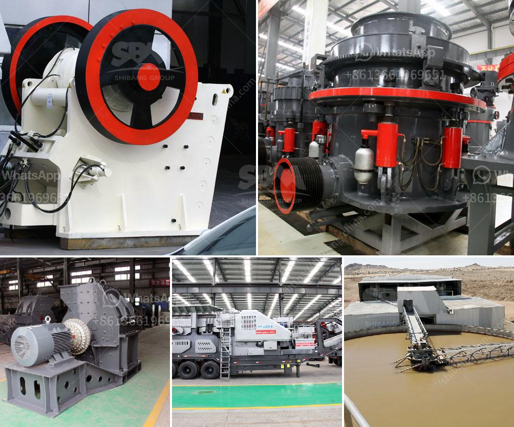

<h3>slag crusher plant manufacturer india</h3>
Slag, also known as blast furnace slag, is a byproduct generated during the manufacturing of pig iron, an essential component in steel production. The slag resulting from this process can be crushed and utilized in various applications, including construction materials, road bases, and even fertilizers. To facilitate the efficient processing of slag, a slag crusher plant is often employed by industries to reduce the particle size of slag into finer fractions that can be easily processed.

One of the leading manufacturers of these slag crushing machines is Cullet Crusher and Slag Crusher Plant Manufacturer, Exporter & Supplier in India. These are broadly utilized for crushing refractory’s, stone, slag, coal and a host of other products. We completely assure our clients of offering slag crushing plant equipment that is known for its high quality, precision and accuracy and long term reliability. We also render services to our esteemed clientele on turnkey basis. Our products are high quality, durable, and yield maximum productivity.

One of the reasons why our machines are considered the best in the industry is our incorporation of cutting-edge technology. Our slag crushing plant is designed with precision and utmost perfection utilizing the latest in technology, which ensures optimum performance. We not only specialize in slag crushing plants but also offer turnkey solutions for industrial waste recycling plants to recover valuable metals from various waste streams.

When it comes to the efficiency and durability of the slag crusher plant, we believe in providing the best quality and performance that surpasses expectations. With a team of experienced engineers and technicians, we manufacture our machines using premium-quality components sourced from trusted vendors.

Our slag crushing plant has been developed keeping in mind that there should be minimal generation of waste during slag crushing and processing. The melted slag, after cooling, is crushed and screened to obtain desired size fractions for various applications. Our slag crushing plant is designed to meet the initial requirements of our clients and ensure their satisfaction. The plant efficiently crushes and screens any slag that may contain metal contaminants, ensuring the highest quality metal recovery.

Furthermore, the slag crusher plant is designed to enable a seamless flow of slag through the crusher, allowing for high efficiency and productivity. These crushers are robustly built, ensuring maximum durability and are manufactured using high-quality raw materials. We offer a wide range of crushers, including jaw crushers, cone crushers, and impact crushers, ensuring that all of our customers' unique requirements are met.

In conclusion, a slag crusher plant is an essential piece of equipment for producing high-quality slag products that can be utilized in a variety of applications. As a reputable manufacturer and supplier of slag crusher plants, we ensure our machines are highly reliable and durable, and optimize their efficiency through incorporating the latest technology. With our commitment to quality and customer satisfaction, we strive to be the leading supplier for all slag crushing solutions in India and beyond.
<h3>Contact us</h3><ul><li><strong>Whatsapp:&nbsp;<a href="https://wa.me/8613661969651">+8613661969651</a></strong></li><li><a href="https://swt.shibang-china.com/?git&amp;zhl&amp;slag crusher plant manufacturer india"><strong>Online Service(chat now)</strong></a></li></ul><h3>Related</h3><ul><li><a href='price of mining conveyor belt in south africa.md'>price of mining conveyor belt in south africa</a></li><li><a href='quarry machine and crusher plant sale in australia.md'>quarry machine and crusher plant sale in australia</a></li><li><a href='slag crusher plant manufacturer india.md'>slag crusher plant manufacturer india</a></li><li><a href='kaolin clay mining process.md'>kaolin clay mining process</a></li><li><a href='stone crusher equipment.md'>stone crusher equipment</a></li></ul>