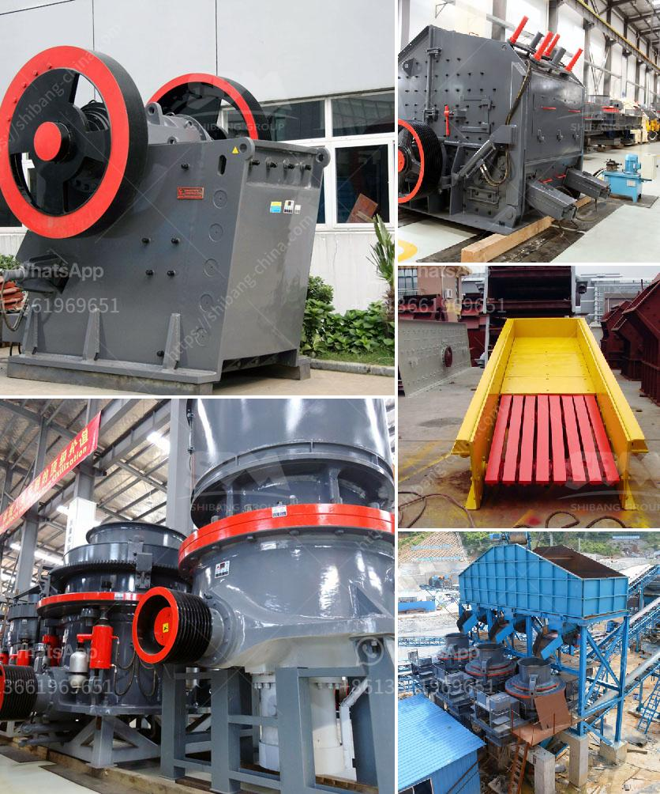

<h3>slag grinding mill</h3>
Slag is a common industrial waste material that is generated during the production of iron and steel. The slag grinding mill plays a vital role in grinding and processing slag. The grinding mill not only enables efficient grinding of the ore, but also helps to improve product quality and enhance the overall production efficiency.

With the rapid development of modern industry, the demand for slag powder is increasing, especially in concrete and cement production. Due to the high demand for slag powder, many companies invest in the slag grinding mill. However, not all slag grinding mills are created equal. It is important to choose a reliable and efficient mill to ensure the highest quality and productivity.

One of the top choices for slag grinding is the vertical roller mill. It is designed with a unique grinding principle and combines grinding, drying, and separating processes into one efficient unit. This mill is equipped with a high-efficient dynamic separator, which ensures high-grade product flow and rejects coarse particles.

The slag grinding mill also boasts a low energy consumption. This is because it uses less power compared to traditional ball mills, which makes it eco-friendly. Additionally, the vertical roller mill has a smaller footprint and is more compact, making it suitable for small spaces or plants with limited space.

Another advantage of the slag grinding mill is its versatility. It can grind not only slag but also other materials, such as limestone, clinker, and raw materials for cement production. This makes it a cost-effective solution for various industries and applications.

In conclusion, the slag grinding mill is a reliable and efficient solution for grinding and processing slag. It helps to improve product quality, enhance production efficiency, and reduce energy consumption. With its versatility and eco-friendly features, the slag grinding mill is becoming increasingly popular in various industries.
<h3>Contact us</h3><ul><li><strong>Whatsapp:&nbsp;<a href="https://wa.me/8613661969651">+8613661969651</a></strong></li><li><a href="https://swt.shibang-china.com/?git&amp;zhl&amp;slag grinding mill"><strong>Online Service(chat now)</strong></a></li></ul><h3>Related</h3><ul><li><a href='kenya roller mill.md'>kenya roller mill</a></li><li><a href='mobile crushers ghana.md'>mobile crushers ghana</a></li><li><a href='small jaw crusher supplier.md'>small jaw crusher supplier</a></li><li><a href='equipment jaw crusher for sale philippine.md'>equipment jaw crusher for sale philippine</a></li><li><a href='jaw crusher price.md'>jaw crusher price</a></li></ul>