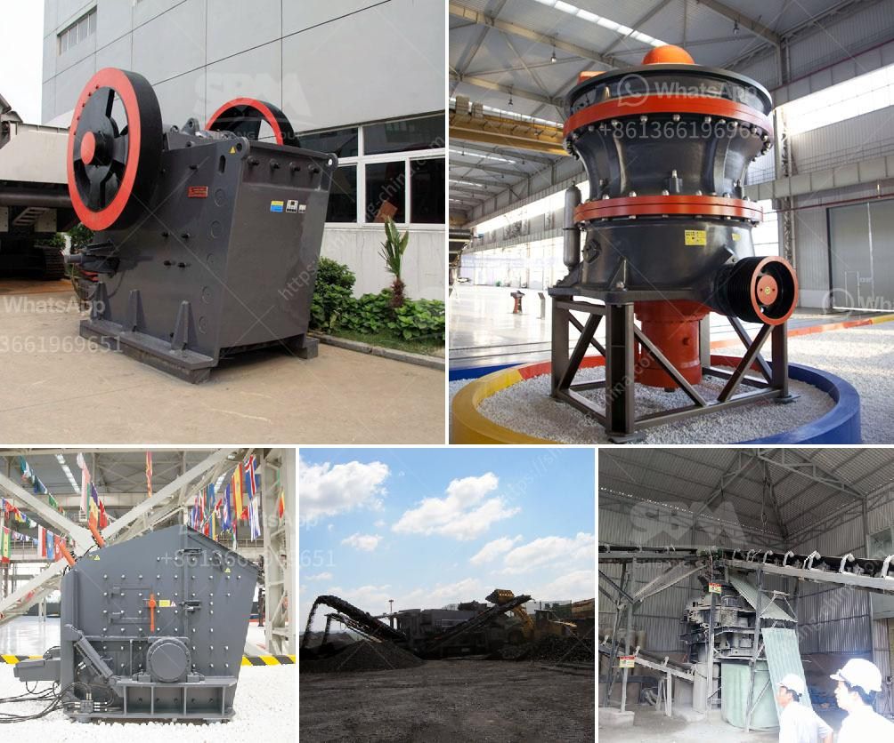

<h3>small ball mill for sale in india</h3>
Small ball mill for sale in India, also known as impact mill or jet mill, is a conventional grinding machine that grinds material into smaller sizes through a combination of attrition and impact forces. It consists of a rotating drum filled with balls, which cause the media to impact and grind against the material being processed.

The small ball mill for sale in India is primarily used for grinding pigments and cement. The material is ground to a fine powder by rotating the drum under the action of centrifugal force and friction. The feed material passes from one end of the drum to the other and is gradually ground as the drum rotates.

This type of ball mill is compact in size, making it ideal for small-scale processing and laboratory use. It is also popular among hobbyists and DIY enthusiasts who enjoy experimenting with different materials and processes. Despite its compact size, the small ball mill for sale in India is powerful enough to grind a wide range of materials, including chemicals, ceramic raw materials, ores, and glass.

Due to its versatility, the small ball mill for sale in India is widely used in various industries, such as mining, metallurgy, cement, and pharmaceuticals. It is also a cost-effective solution for reducing the size of particles in research and development laboratories. Additionally, the small ball mill can be used in conjunction with other equipment, such as crushers, conveyors, and classifiers, to create a complete grinding system.

When purchasing a small ball mill for sale in India, it is important to consider factors such as the desired particle size, throughput capacity, and power requirements. It is also crucial to choose a reputable supplier who can provide after-sales service and technical support. By investing in a reliable and efficient small ball mill, businesses and individuals can enhance their processing capabilities while achieving consistent and high-quality results.
<h3>Contact us</h3><ul><li><strong>Whatsapp:&nbsp;<a href="https://wa.me/8613661969651">+8613661969651</a></strong></li><li><a href="https://swt.shibang-china.com/?git&amp;zhl&amp;small ball mill for sale in india"><strong>Online Service(chat now)</strong></a></li></ul><h3>Related</h3><ul><li><a href='hammer mill for coal in india.md'>hammer mill for coal in india</a></li><li><a href='puzzolana jaw crusher price in india.md'>puzzolana jaw crusher price in india</a></li><li><a href='quartz plants for sale.md'>quartz plants for sale</a></li><li><a href='mobile crushing plant manufacturers.md'>mobile crushing plant manufacturers</a></li><li><a href='quarry plant in nigeria.md'>quarry plant in nigeria</a></li></ul>