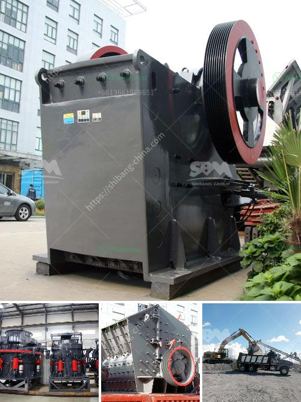

<h3>small cement grinding machine</h3>
A small cement grinding machine is commonly used in cement plants for raw material grinding or grinding cement clinker into cement products. It can also be used for other materials such as coal, slag, limestone, petroleum coke, etc., as vertical roller mills (VRM) have become increasingly popular over the years due to their high efficiency and energy-saving capabilities.

With advancements in technology and design, small cement grinding machines now offer a compact and efficient solution for industries looking for cost-effective grinding options. These machines are typically equipped with a motor, grinding table, hydraulic system, and other essential components necessary for grinding processes.

One of the main advantages of a small cement grinding machine is its compact size, which makes it suitable for use in smaller spaces. Whether it is a cement plant with limited floor space or a construction site where space is a premium, these machines can easily fit into tight areas. Their compact design also allows for easy transportation and relocation, enabling them to be used at multiple locations if required.

Furthermore, a small cement grinding machine is highly efficient and offers energy-saving capabilities. Most of these machines use a vertically oriented grinding table and a set of rollers, which ensures uniform grinding and better particle size distribution. This results in higher productivity and a significant reduction in energy consumption compared to traditional ball mills or other grinding equipment.

In addition to their compactness and efficiency, small cement grinding machines also offer precise control over the grinding process. Operators can adjust various parameters, such as grinding pressure, grinding speed, and separator rotor speed, to achieve the desired fineness and quality of the final cement product. This level of control allows for better optimization of the grinding process and ensures consistent and uniform cement production.

Moreover, small cement grinding machines are designed to be durable and require minimal maintenance. Most components are made from high-quality materials, which can withstand the demanding conditions of the grinding process. Regular maintenance and inspection can help prolong the machine's lifespan and ensure uninterrupted operation.

When considering the purchase of a small cement grinding machine, it is important to evaluate the specific requirements of your operation. Factors such as required capacity, fineness of the final product, and available space should be taken into account. Consulting with a reputable manufacturer or supplier is recommended to ensure that you choose the right machine for your needs.

In conclusion, small cement grinding machines offer a compact and efficient solution for industries looking for cost-effective grinding options. With their compact design, high efficiency, and precise control over the grinding process, these machines are suitable for various applications in the cement industry. When properly maintained, they can provide reliable and consistent grinding performance, contributing to improved productivity and quality of cement production.
<h3>Contact us</h3><ul><li><strong>Whatsapp:&nbsp;<a href="https://wa.me/8613661969651">+8613661969651</a></strong></li><li><a href="https://swt.shibang-china.com/?git&amp;zhl&amp;small cement grinding machine"><strong>Online Service(chat now)</strong></a></li></ul><h3>Related</h3><ul><li><a href='mobile crushing machine sales in south africa.md'>mobile crushing machine sales in south africa</a></li><li><a href='cone crushers for sale in philippines.md'>cone crushers for sale in philippines</a></li><li><a href='sand making machine.md'>sand making machine</a></li><li><a href='stone quarry equipment.md'>stone quarry equipment</a></li><li><a href='stone crusher in davao.md'>stone crusher in davao</a></li></ul>