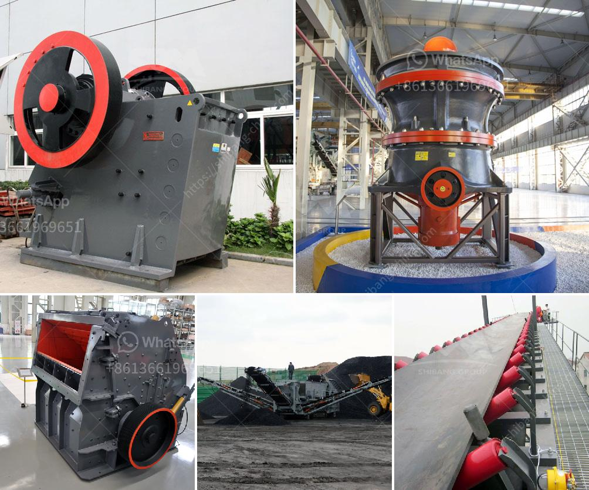

<h3>small cement plant for sale</h3>
Are you an entrepreneur looking to invest in the construction industry? Consider purchasing a small cement plant! The market for cement is ever-growing, and with the right equipment and business strategy, you can achieve great success. There are various options available, including small cement plants for sale, which can cater to the needs of different investors.

A small cement plant is an ideal investment opportunity for individuals or businesses with a limited budget but a strong passion for construction. These plants typically produce a lower capacity of cement compared to large-scale factories. However, they are perfect for serving local markets and meeting the demand for construction materials in the area.

One major advantage of a small cement plant is the ability to have control over the entire production process. With a compact setup, you can closely monitor the quality of the cement being produced and make any necessary adjustments. This level of control enables you to ensure that your product meets the highest industry standards, thus optimizing customer satisfaction.

Furthermore, small cement plants often offer cost advantages over larger plants. These savings can be reflected in the selling price, making your cement more competitive in the market. Additionally, their smaller size allows for easier maintenance and operational management, resulting in reduced expenses and improved efficiency.

Purchasing a small cement plant for sale also offers a flexible growth opportunity. As your business expands and demand increases, you can easily look into scaling up your production capacity. This can be done by investing in additional machinery or even upgrading to a larger facility. With a solid customer base and a well-established reputation, taking this step can be financially rewarding and help you establish yourself as a key player in the cement industry.

Whether you are an experienced player in the construction sector or a budding entrepreneur, a small cement plant for sale can be a great investment opportunity. With the right business plan, quality control measures, and an understanding of the local market, you can take advantage of the booming demand for cement and forge a successful path in the industry.
<h3>Contact us</h3><ul><li><strong>Whatsapp:&nbsp;<a href="https://wa.me/8613661969651">+8613661969651</a></strong></li><li><a href="https://swt.shibang-china.com/?git&amp;zhl&amp;small cement plant for sale"><strong>Online Service(chat now)</strong></a></li></ul><h3>Related</h3><ul><li><a href='marble powder mill machinery.md'>marble powder mill machinery</a></li><li><a href='roller crusher on sale.md'>roller crusher on sale</a></li><li><a href='sewa mobil crusher di kaltim.md'>sewa mobil crusher di kaltim</a></li><li><a href='portable machine stone crusher machine for sale.md'>portable machine stone crusher machine for sale</a></li><li><a href='dolomite grinding mill for sale in india.md'>dolomite grinding mill for sale in india</a></li></ul>